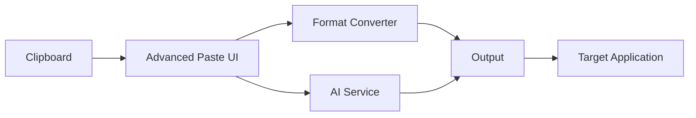

## Overview

Advanced Paste is a powerful clipboard enhancement utility that extends Windows' standard paste functionality with intelligent transformations, format conversions, and AI-powered text processing. It provides quick access to multiple paste formats and custom clipboard operations.

<Info>
Advanced Paste can be controlled via GPO (Group Policy Object) settings in enterprise environments.
</Info>

## Activation

Advanced Paste can be activated in multiple ways:

<Steps>
  <Step title="Using Keyboard Shortcut">
    Press the configured hotkey (default: `Win+Shift+V`) to open the Advanced Paste window
  </Step>
  
  <Step title="From PowerToys Settings">
    Enable Advanced Paste in the PowerToys Settings UI under the Advanced Paste section
  </Step>
  
  <Step title="Programmatic Launch">
    Use the `ColorPickerService.Instance.LaunchAsync()` API from other applications
  </Step>
</Steps>

## Key Features

### Core Paste Actions

Advanced Paste provides several built-in paste transformations:

<CardGroup cols={2}>
  <Card title="Paste as Plain Text" icon="file-lines">
    Remove all formatting and paste content as plain text
    
    **Shortcut:** `Ctrl+1` (in Advanced Paste window)
  </Card>
  
  <Card title="Paste as Markdown" icon="markdown">
    Convert clipboard content to Markdown format
    
    **Shortcut:** `Ctrl+2` (in Advanced Paste window)
  </Card>
  
  <Card title="Paste as JSON" icon="code">
    Convert and format clipboard content as JSON
    
    **Shortcut:** `Ctrl+3` (in Advanced Paste window)
  </Card>
  
  <Card title="AI-Powered Paste" icon="sparkles">
    Transform clipboard content using AI prompts
  </Card>
</CardGroup>

### AI Integration

Advanced Paste integrates with multiple AI services for intelligent text transformation:

```csharp
// AI Service Support (from AdvancedPaste.csproj)
// Microsoft.SemanticKernel.Connectors.AzureAIInference
// Microsoft.SemanticKernel.Connectors.Google
// Microsoft.SemanticKernel.Connectors.MistralAI
// Microsoft.SemanticKernel.Connectors.Ollama
```

Supported AI providers:
- Azure AI Inference
- Google AI
- MistralAI
- Ollama (local AI models)
- Custom OpenAI endpoints

### Custom Actions

Create and save custom paste transformations for frequently used operations:

1. Open Advanced Paste window
2. Navigate to custom actions section
3. Define your transformation prompt
4. Save and assign a keyboard shortcut

### Clipboard History Integration

Advanced Paste works seamlessly with Windows Clipboard History (`Win+V`) and provides preview controls for clipboard items.

## Configuration

### Settings Location

Settings are stored in:
```
%LOCALAPPDATA%\Microsoft\PowerToys\AdvancedPaste\settings.json
```

### Available Options

<ParamField path="CloseAfterLosingFocus" type="boolean" default="false">
  Automatically close the Advanced Paste window when it loses focus
</ParamField>

<ParamField path="AdditionalActions" type="array">
  List of user-defined custom paste actions with prompts and shortcuts
</ParamField>

<ParamField path="CustomActions" type="array">
  AI-powered custom actions with natural language transformation prompts
</ParamField>

<ParamField path="IsCustomAIServiceEnabled" type="boolean" default="false">
  Enable custom AI service configuration for transformations
</ParamField>

### Activation Shortcut

Configure the global hotkey to open Advanced Paste:

1. Open PowerToys Settings
2. Navigate to Advanced Paste
3. Click on the activation shortcut field
4. Press your desired key combination
5. Click Save

<Warning>
Ensure the shortcut doesn't conflict with other system or application shortcuts.
</Warning>

## Use Cases

### Format Conversion

<AccordionGroup>
  <Accordion title="Rich Text to Plain Text">
    Copy formatted content from a website or document, then use Advanced Paste to strip all formatting:
    
    1. Copy rich text content (`Ctrl+C`)
    2. Open Advanced Paste (`Win+Shift+V`)
    3. Select "Paste as Plain Text" or press `Ctrl+1`
  </Accordion>
  
  <Accordion title="HTML to Markdown">
    Convert web content to Markdown for documentation:
    
    1. Copy HTML content from a webpage
    2. Open Advanced Paste
    3. Select "Paste as Markdown" (`Ctrl+2`)
  </Accordion>
  
  <Accordion title="Data to JSON">
    Transform tabular data into JSON format:
    
    1. Copy table or structured data
    2. Open Advanced Paste
    3. Select "Paste as JSON" (`Ctrl+3`)
  </Accordion>
</AccordionGroup>

### AI-Powered Transformations

<CodeGroup>
```text Example: Summarize Text
Prompt: "Summarize the following text in 2-3 sentences"
Input: [Long article from clipboard]
Output: Concise summary ready to paste
```

```text Example: Translate Text
Prompt: "Translate to Spanish"
Input: English text from clipboard
Output: Spanish translation
```

```text Example: Code Formatting
Prompt: "Format this code with proper indentation and add comments"
Input: Unformatted code snippet
Output: Clean, documented code
```
</CodeGroup>

### Workflow Automation

Combine Advanced Paste with other PowerToys utilities:

- Use **Text Extractor** to capture text from images, then transform with Advanced Paste
- Copy file paths with **File Explorer Add-ons**, then format as needed
- Extract data with **PowerToys Run**, then convert format with Advanced Paste

## Keyboard Shortcuts

### Global Shortcuts

| Shortcut | Action |
|----------|--------|
| `Win+Shift+V` | Open Advanced Paste window (default) |

### In-App Shortcuts

When Advanced Paste window is open:

| Shortcut | Action |
|----------|--------|
| `Ctrl+1` | Paste as Plain Text |
| `Ctrl+2` | Paste as Markdown |
| `Ctrl+3` | Paste as JSON |
| `Ctrl+[N]` | Custom action N (user-configured) |
| `Esc` | Close window |

## Technical Details

### Architecture



### Dependencies

- **Microsoft.SemanticKernel**: AI transformation engine
- **ReverseMarkdown**: HTML to Markdown conversion
- **System.Text.Json**: JSON processing
- **WinUI 3**: Modern Windows UI framework

### Source Code Reference

Key implementation files:

- Main application: `src/modules/AdvancedPaste/AdvancedPaste/Program.cs:19`
- Window management: `src/modules/AdvancedPaste/AdvancedPaste/AdvancedPasteXAML/MainWindow.xaml.cs:31`
- Clipboard operations: `src/modules/AdvancedPaste/AdvancedPaste/Helpers/ClipboardHelper.cs`

## Troubleshooting

<AccordionGroup>
  <Accordion title="Advanced Paste window doesn't open">
    **Possible causes:**
    - Shortcut conflict with another application
    - GPO policy has disabled the utility
    - PowerToys is not running
    
    **Solutions:**
    1. Check if PowerToys is running in system tray
    2. Verify shortcut in PowerToys Settings
    3. Contact IT administrator about GPO settings
  </Accordion>
  
  <Accordion title="AI transformations not working">
    **Possible causes:**
    - AI service not configured
    - Network connectivity issues
    - API key invalid or expired
    
    **Solutions:**
    1. Open PowerToys Settings > Advanced Paste > AI Configuration
    2. Verify API credentials
    3. Test with local Ollama if available
  </Accordion>
  
  <Accordion title="Custom actions not saving">
    **Check:**
    - Settings file permissions in `%LOCALAPPDATA%\Microsoft\PowerToys\AdvancedPaste`
    - Disk space availability
    - File is not set as read-only
  </Accordion>
</AccordionGroup>

## See Also

- [Keyboard Manager](/utilities/keyboard-manager) - Remap keys for custom shortcuts
- [PowerToys Run](/utilities/powertoys-run) - Quick launcher integration
- [Text Extractor](/utilities/text-extractor) - OCR for clipboard content
