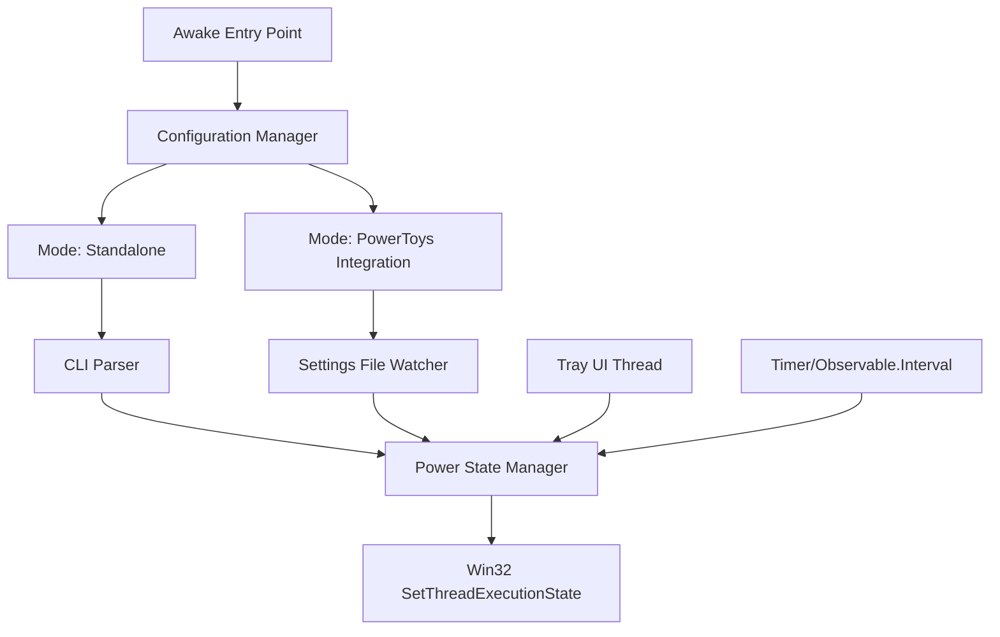

## Overview

Awake is a utility that prevents Windows from entering sleep mode or turning off the display. It provides flexible control over your computer's power state with support for indefinite, timed, and process-bound keep-awake modes.

<Info>
Awake uses the Win32 `SetThreadExecutionState()` API with `ES_SYSTEM_REQUIRED` and `ES_DISPLAY_REQUIRED` flags.
</Info>

## Activation

<Steps>
  <Step title="Enable via PowerToys">
    Open PowerToys Settings and enable **Awake** in the utilities list
  </Step>
  
  <Step title="Configure Mode">
    Choose from PASSIVE, INDEFINITE, TIMED, or EXPIRABLE modes
  </Step>
  
  <Step title="Access via Tray Icon">
    Right-click the Awake system tray icon for quick mode changes
  </Step>
</Steps>

### Standalone Command-Line Usage

Awake can also run independently with CLI arguments:

```powershell
PowerToys.Awake.exe [options]
```

## Key Features

### Operating Modes

<CardGroup cols={2}>
  <Card title="PASSIVE" icon="moon">
    Normal power behavior (utility disabled)
    
    System can sleep normally
  </Card>
  
  <Card title="INDEFINITE" icon="infinity">
    Keep awake until manually stopped
    
    Most common mode for extended work
  </Card>
  
  <Card title="TIMED" icon="clock">
    Keep awake for specific duration
    
    **Example:** 2 hours, 30 minutes
  </Card>
  
  <Card title="EXPIRABLE" icon="calendar">
    Keep awake until specific date/time
    
    **Example:** Until 11:59 PM today
  </Card>
</CardGroup>

### Display Control

Independent control of display sleep behavior:

```csharp
// Power state flags used by Awake
ES_SYSTEM_REQUIRED   // Prevents system sleep
ES_DISPLAY_REQUIRED  // Prevents display sleep
ES_CONTINUOUS        // Maintains state until changed
```

<Warning>
**Task Scheduler Limitation:** When "Keep display on" is enabled, Windows Task Scheduler cannot detect system as idle. This prevents scheduled maintenance tasks (TRIM, defragmentation) from running automatically.

See [Known Limitations](#known-limitations) for workarounds.
</Warning>

### Timed Operation

Set duration-based keep-awake periods:

```powershell
# Keep system awake for 1 hour
PowerToys.Awake.exe --time-limit 3600

# Keep awake for 2 hours with display on
PowerToys.Awake.exe --time-limit 7200 --display-on
```

Time limit specified in seconds.

### Expiration Scheduling

Keep system awake until specific date/time:

```powershell
# Keep awake until end of day
PowerToys.Awake.exe --expire-at "2026-03-04 23:59:59"

# Keep awake until specific time
PowerToys.Awake.exe --expire-at "2026-03-04 17:30:00" --display-on
```

### Process Binding

Bind Awake to another process lifecycle:

```powershell
# Keep awake while process 1234 is running
PowerToys.Awake.exe --pid 1234

# Bind to parent PowerToys process
PowerToys.Awake.exe --use-parent-pid
```

When bound process terminates, Awake automatically exits.

### System Tray Integration

Awake provides a custom tray icon implementation:

```csharp
// Pure Win32 API for minimal footprint (no WPF/WinForms)
// Uses Shell_NotifyIcon API for tray management
// Custom SynchronizationContext for thread-safe UI updates
```

Right-click tray icon to:
- Switch between operating modes
- Toggle display keep-awake
- Set timed durations
- Open PowerToys Settings
- Exit Awake

## Configuration

### Settings Location

When using PowerToys integration:
```
%LOCALAPPDATA%\Microsoft\PowerToys\Awake\settings.json
```

### Command-Line Options

<ParamField path="--use-pt-config" type="flag">
  Use PowerToys configuration file instead of command-line settings
  
  **Short:** `-c`
</ParamField>

<ParamField path="--display-on" type="flag">
  Keep display on (prevents monitor sleep)
  
  **Short:** `-d`
  
  **Default:** `false`
</ParamField>

<ParamField path="--time-limit" type="number">
  Time limit in seconds
  
  **Short:** `-t`
  
  **Example:** `3600` (1 hour)
</ParamField>

<ParamField path="--pid" type="number">
  Process ID to bind to
  
  **Short:** `-p`
  
  **Behavior:** Awake exits when specified process terminates
</ParamField>

<ParamField path="--expire-at" type="datetime">
  Expiration date and time
  
  **Short:** `-e`
  
  **Format:** `YYYY-MM-DD HH:MM:SS`
</ParamField>

<ParamField path="--use-parent-pid" type="flag">
  Bind to parent process automatically
  
  **Short:** `-u`
  
  **Use case:** When launched by PowerToys runner
</ParamField>

### PowerToys Settings UI

Configure Awake through PowerToys Settings:

1. **Mode Selection**: Choose operating mode from dropdown
2. **Display Keep-Awake**: Toggle display sleep prevention
3. **Duration Picker**: Set hours and minutes for timed mode
4. **Expiration Picker**: Choose date and time for expirable mode

## Use Cases

### Long-Running Operations

<AccordionGroup>
  <Accordion title="Software Compilation">
    Prevent sleep during overnight builds:
    
    ```powershell
    # Start build then enable Awake
    msbuild LargeSolution.sln /m
    # Enable INDEFINITE mode via tray icon
    ```
    
    Or use timed mode:
    ```powershell
    PowerToys.Awake.exe --time-limit 28800  # 8 hours
    ```
  </Accordion>
  
  <Accordion title="Data Processing">
    Keep system awake during data analysis or ETL jobs:
    
    ```powershell
    # Bind Awake to Python process
    $process = Start-Process python analyze_data.py -PassThru
    PowerToys.Awake.exe --pid $process.Id --display-on
    ```
  </Accordion>
  
  <Accordion title="File Transfers">
    Prevent sleep during large file uploads or downloads:
    
    1. Start file transfer
    2. Enable Awake INDEFINITE mode
    3. Disable "Keep display on" to save power
    4. Disable Awake when complete
  </Accordion>
</AccordionGroup>

### Presentations & Meetings

<Steps>
  <Step title="Before Meeting">
    Enable Awake INDEFINITE mode with display keep-awake
  </Step>
  
  <Step title="During Meeting">
    System and display remain active without interaction
  </Step>
  
  <Step title="After Meeting">
    Disable Awake or use timed mode (e.g., 2-hour meeting)
  </Step>
</Steps>

```powershell
# Set up for 2-hour presentation
PowerToys.Awake.exe --time-limit 7200 --display-on
```

### Development & Testing

<CardGroup cols={2}>
  <Card title="Server Testing">
    Keep system awake while running local development servers
    
    ```bash
    # Bind to Node.js server process
    node server.js &
    PowerToys.Awake.exe --pid $!
    ```
  </Card>
  
  <Card title="Automated Testing">
    Prevent sleep during long test suite runs
    
    ```powershell
    # Run tests with Awake
    PowerToys.Awake.exe --time-limit 3600
    pytest tests/ --verbose
    ```
  </Card>
  
  <Card title="Database Operations">
    Keep awake during database migrations or backups
    
    ```powershell
    # Expire when maintenance window ends
    PowerToys.Awake.exe --expire-at "2026-03-05 06:00:00"
    ```
  </Card>
  
  <Card title="Monitoring Dashboards">
    Display monitoring systems without sleep
    
    Enable INDEFINITE with display on
  </Card>
</CardGroup>

### Media & Downloads

Common scenarios:

- **Video Rendering**: Keep system awake during video export
- **Batch Downloads**: Prevent sleep while downloading large files
- **Media Streaming**: Maintain display during video playback
- **Music Playback**: Keep system active for extended listening

## Technical Details

### Architecture



### Design Highlights

<Tabs>
  <Tab title="Pure Win32 Tray">
    No WPF/WinForms dependencies for minimal binary size
    
    ```csharp
    // Direct Shell_NotifyIcon API usage
    // Custom SynchronizationContext for thread-safe updates
    // Tray operations run on dedicated thread
    ```
    
    **File:** `src/modules/awake/Awake/Core/TrayHelper.cs`
  </Tab>
  
  <Tab title="Reactive Extensions">
    Uses Rx.NET for timer operations:
    
    ```csharp
    // Timed mode using Observable.Timer()
    Observable.Timer(TimeSpan.FromSeconds(timeLimit))
              .Subscribe(_ => SetMode(AwakeMode.PASSIVE));
    
    // File watcher with 25ms throttle for config changes
    fileWatcher.Changed
               .Throttle(TimeSpan.FromMilliseconds(25))
               .Subscribe(LoadSettings);
    ```
    
    **Dependency:** `System.Reactive` NuGet package
  </Tab>
  
  <Tab title="Dual Operation Mode">
    **Standalone Mode:**
    - Command-line arguments only
    - No PowerToys dependency
    - Direct execution
    
    **Integrated Mode:**
    - PowerToys settings file (`--use-pt-config`)
    - Process binding to runner (`--use-parent-pid`)
    - Managed by PowerToys lifecycle
    
    **File:** `src/modules/awake/Awake/Program.cs`
  </Tab>
</Tabs>

### Key Components

| Component | Purpose | File |
|-----------|---------|------|
| `Program.cs` | Entry point & CLI parsing | `src/modules/awake/Awake/Program.cs` |
| `Manager.cs` | State orchestration & power management | `src/modules/awake/Awake/Core/Manager.cs` |
| `TrayHelper.cs` | System tray UI management | `src/modules/awake/Awake/Core/TrayHelper.cs` |
| `Bridge.cs` | Win32 P/Invoke declarations | `src/modules/awake/Awake/Core/Native/Bridge.cs` |

### Dependencies

```xml
<!-- From Awake.csproj -->
<PackageReference Include="System.CommandLine" />  <!-- CLI parsing -->
<PackageReference Include="System.Reactive" />     <!-- Rx.NET timers -->
<PackageReference Include="PowerToys.ManagedCommon" />
<PackageReference Include="PowerToys.Settings.UI.Lib" />
<PackageReference Include="PowerToys.Interop" />
```

## Known Limitations

### Task Scheduler Idle Detection

<Warning>
**Issue:** When "Keep display on" is enabled (`ES_DISPLAY_REQUIRED` flag), Windows Task Scheduler cannot detect system as idle.

**Impact:**
- Scheduled maintenance tasks won't run automatically
- SSD TRIM operations may be delayed
- Disk defragmentation skipped
- Other idle-triggered tasks postponed

**Microsoft Documentation:**
> "An exception would be for any presentation type application that sets the ES_DISPLAY_REQUIRED flag. This flag forces Task Scheduler to not consider the system as being idle, regardless of user activity or resource consumption."

**GitHub Issue:** [#44134](https://github.com/microsoft/PowerToys/issues/44134)
</Warning>

### Workarounds

<AccordionGroup>
  <Accordion title="Disable 'Keep display on'">
    Only use `ES_SYSTEM_REQUIRED` without `ES_DISPLAY_REQUIRED`:
    
    - Prevents system sleep
    - Allows Task Scheduler idle detection
    - Display can still turn off
    
    **Configuration:** Uncheck "Keep display on" in Awake settings
  </Accordion>
  
  <Accordion title="Manual maintenance tasks">
    Run maintenance tasks manually when needed:
    
    ```powershell
    # Run TRIM manually (as Administrator)
    Optimize-Volume -DriveLetter C -ReTrim -Verbose
    
    # Check defragmentation status
    Optimize-Volume -DriveLetter C -Analyze -Verbose
    
    # Run defragmentation
    Optimize-Volume -DriveLetter C -Defrag -Verbose
    ```
  </Accordion>
  
  <Accordion title="Schedule Awake off periods">
    Use timed or expirable modes to allow maintenance windows:
    
    ```powershell
    # Work hours only (8 AM to 6 PM)
    PowerToys.Awake.exe --expire-at "2026-03-04 18:00:00"
    
    # Allows overnight maintenance tasks
    ```
  </Accordion>
</AccordionGroup>

## Troubleshooting

<AccordionGroup>
  <Accordion title="System still goes to sleep">
    **Possible causes:**
    - Awake not running (check system tray)
    - Mode set to PASSIVE
    - Group Policy overriding power settings
    - Laptop lid closed (triggers sleep regardless)
    
    **Solutions:**
    1. Verify Awake tray icon is present
    2. Check current mode in tray menu
    3. Review Group Policy power settings
    4. Use external monitor with lid closed
  </Accordion>
  
  <Accordion title="Display still turns off">
    **Check:**
    - "Keep display on" is enabled in Awake settings
    - Display timeout in Windows power settings
    - Screen saver is disabled
    
    **Note:** Some applications may override display settings
  </Accordion>
  
  <Accordion title="Tray icon not appearing">
    **Troubleshooting:**
    1. Check if PowerToys is running
    2. Look in system tray overflow area
    3. Restart PowerToys
    4. Check Windows notification area settings
    
    **Implementation:** `src/modules/awake/Awake/Core/TrayHelper.cs`
  </Accordion>
  
  <Accordion title="Timed mode not expiring">
    **Verify:**
    - Time limit is set correctly (in seconds)
    - System clock is accurate
    - No configuration file changes overriding timer
    
    **Debug:** Check Awake logs in `%LOCALAPPDATA%\Microsoft\PowerToys\Awake\Logs`
  </Accordion>
</AccordionGroup>

## See Also

- [PowerToys Settings](/configuration/settings-overview) - Configure Awake options
- [Command Not Found](/utilities/command-not-found) - Another CLI utility
- [Registry Preview](/utilities/registry-preview) - System utility tool

## Resources

- **Official Website**: [awake.den.dev](https://awake.den.dev)
- **Microsoft Learn**: [PowerToys Awake Documentation](https://learn.microsoft.com/windows/powertoys/awake)
- **GitHub Issues**: [Report bugs or request features](https://github.com/microsoft/PowerToys/issues?q=is%3Aissue+label%3AProduct-Awake)
- **Source Code**: `src/modules/awake/README.md`
