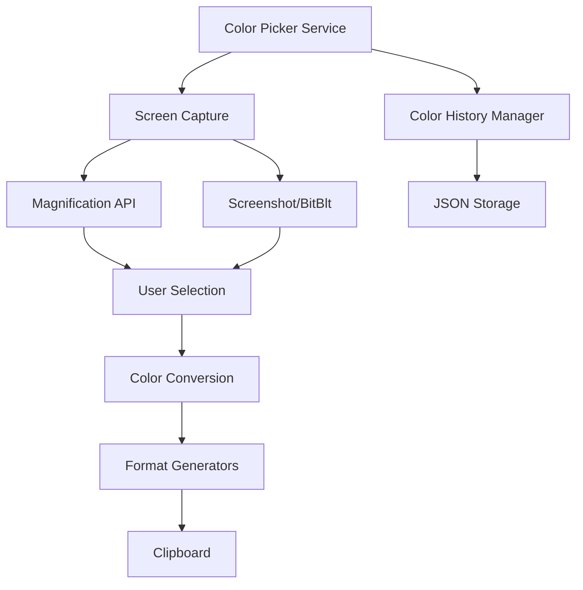

## Overview

Color Picker is a system-wide utility that allows you to pick colors from anywhere on your screen and copy them in various formats. It includes color history management and supports multiple color format outputs.

<Tip>
Color Picker can be launched programmatically via the `ColorPickerService` API for integration with other applications.
</Tip>

## Activation

<Steps>
  <Step title="Enable Color Picker">
    Open PowerToys Settings and enable **Color Picker** in the utilities list
  </Step>
  
  <Step title="Launch Picker">
    Press the activation shortcut (default: `Win+Shift+C`)
  </Step>
  
  <Step title="Select Color">
    Click anywhere on screen to pick the color at that location
  </Step>
</Steps>

### Programmatic Launch

```csharp
// Launch Color Picker from code
using ColorPicker.ModuleServices;

await ColorPickerService.Instance.OpenPickerAsync();
```

**File reference:** `src/modules/colorPicker/ColorPicker.ModuleServices/ColorPickerService.cs:34`

## Key Features

### Color Picking Modes

<CardGroup cols={2}>
  <Card title="Screen Picker" icon="droplet">
    Pick any color from your screen
    
    Magnified view for pixel-perfect selection
  </Card>
  
  <Card title="Color History" icon="clock-rotate-left">
    Access previously picked colors
    
    Stored in `colorHistory.json`
  </Card>
  
  <Card title="Fine-Tune Zoom" icon="magnifying-glass">
    Zoom in for precise color selection
    
    Adjustable zoom level
  </Card>
  
  <Card title="Multi-Format Copy" icon="copy">
    Copy color in multiple formats simultaneously
    
    Configurable format list
  </Card>
</CardGroup>

### Supported Color Formats

Color Picker supports numerous color format outputs:

<Tabs>
  <Tab title="Web Formats">
    - **HEX** - `#FF5733`
    - **RGB** - `rgb(255, 87, 51)`
    - **RGBA** - `rgba(255, 87, 51, 1.0)`
    - **HSL** - `hsl(14, 100%, 60%)`
    - **HSLA** - `hsla(14, 100%, 60%, 1.0)`
    - **HSV** - `hsv(14, 80%, 100%)`
  </Tab>
  
  <Tab title="Design Formats">
    - **CMYK** - `cmyk(0%, 66%, 80%, 0%)`
    - **HSB** - `hsb(14, 80%, 100%)`
    - **HSI** - `hsi(14, 73%, 67%)`
    - **HWB** - `hwb(14, 20%, 0%)`
    - **NCol** - `R10, 80%, 100%`
  </Tab>
  
  <Tab title="Programming Formats">
    - **Decimal** - `16737075`
    - **Float RGB** - `(1.0f, 0.34f, 0.2f)`
    - **C# Color** - `Color.FromArgb(255, 87, 51)`
    - **VEC4** - `(1.0, 0.34, 0.2, 1.0)`
  </Tab>
</Tabs>

### Color History

Automatic tracking of picked colors:

```csharp
// Retrieve saved color history (ColorPickerService.cs:39)
public Task<OperationResult<IReadOnlyList<SavedColor>>> GetSavedColorsAsync()
{
    var historyPath = Path.Combine(
        Environment.GetFolderPath(Environment.SpecialFolder.LocalApplicationData),
        "Microsoft", "PowerToys", "ColorPicker", "colorHistory.json"
    );
    
    // Returns list of SavedColor objects with:
    // - Hex representation
    // - ARGB values
    // - Formatted strings for all enabled formats
}
```

**History file location:**
```
%LOCALAPPDATA%\Microsoft\PowerToys\ColorPicker\colorHistory.json
```

### Zoom and Precision

Enhanced color picking accuracy:

- **Magnified Viewport**: Enlarged pixel view under cursor
- **Pixel Grid**: Clear pixel boundaries for exact selection
- **RGB Preview**: Real-time color value display
- **Mouse Wheel Zoom**: Adjust magnification level dynamically

## Configuration

### Activation Shortcut

<ParamField path="activation_shortcut" type="hotkey" default="Win+Shift+C">
  Global hotkey to launch Color Picker
  
  Configurable modifier keys:
  - Win (Windows key)
  - Alt
  - Shift
  - Ctrl
  
  Plus any virtual key code
</ParamField>

```cpp
// Hotkey structure (from dllmain.cpp:)
struct Hotkey {
    bool win;     // Windows key
    bool alt;     // Alt key
    bool shift;   // Shift key
    bool ctrl;    // Ctrl key
    UINT code;    // Virtual key code
};
```

**Configuration file:** PowerToys settings JSON

### Color Format Selection

Choose which formats to include when copying colors:

1. Open PowerToys Settings
2. Navigate to Color Picker
3. Scroll to "Color formats"
4. Check formats to enable
5. Reorder formats by dragging

When you pick a color, all enabled formats are copied to clipboard as multi-line text.

### Editor Integration

Optional: Configure which editor opens color history:

- **Default**: Internal viewer
- **Custom**: Specify external color management tool

### Appearance Options

<ParamField path="show_color_name" type="boolean" default="false">
  Display color names (e.g., "Red", "Midnight Blue") alongside hex values
</ParamField>

<ParamField path="activation_behavior" type="enum" default="openEditor">
  What happens when activation shortcut is pressed:
  - `openEditor` - Open color picker interface
  - `openColorPickerAndThenEditor` - Pick color, then open editor
</ParamField>

<ParamField path="color_format_for_clipboard" type="enum" default="hex">
  Default format for quick copy operations
</ParamField>

## Use Cases

### Web Development

<Steps>
  <Step title="Pick Brand Colors">
    Sample colors from design mockups or competitor websites
    
    ```plaintext
    1. Open design in browser
    2. Press Win+Shift+C
    3. Click on color to sample
    4. Paste into CSS: #FF5733
    ```
  </Step>
  
  <Step title="Extract Color Palettes">
    Build color schemes from existing designs
    
    Pick multiple colors, check history, export palette
  </Step>
  
  <Step title="Accessibility Testing">
    Verify color contrast ratios:
    
    1. Pick foreground color
    2. Pick background color
    3. Calculate contrast ratio
    4. Ensure WCAG compliance
  </Step>
</Steps>

### Graphic Design

<AccordionGroup>
  <Accordion title="Color Matching">
    Match colors across different applications:
    
    - Sample from reference image
    - Copy in design tool format (HSB, CMYK)
    - Paste into design software
    - Ensure exact color reproduction
  </Accordion>
  
  <Accordion title="Brand Consistency">
    Maintain consistent branding:
    
    1. Pick brand colors from official assets
    2. Save to color history
    3. Reference when creating new designs
    4. Copy in required format (HEX, RGB, CMYK)
  </Accordion>
  
  <Accordion title="Color Exploration">
    Discover interesting color combinations:
    
    - Sample from photos or artwork
    - Build color palettes from nature
    - Experiment with color relationships
    - Document successful combinations
  </Accordion>
</AccordionGroup>

### UI Development

<CodeGroup>
```csharp C# / WPF
// Pick color from screen: #FF5733
// Use in XAML:
<SolidColorBrush Color="#FF5733" />

// Or programmatically:
var color = Color.FromArgb(255, 87, 51);
```

```swift Swift / iOS
// Pick color from screen: rgb(255, 87, 51)
// Convert to UIColor:
let color = UIColor(
    red: 255/255.0,
    green: 87/255.0,
    blue: 51/255.0,
    alpha: 1.0
)
```

```css CSS / Web
/* Picked color formats */
.element {
    background: #FF5733;                  /* HEX */
    color: rgb(255, 87, 51);             /* RGB */
    border: 1px solid hsl(14, 100%, 60%); /* HSL */
}
```

```java Java / Android
// Pick color: #FF5733
// Use in Android:
int color = Color.parseColor("#FF5733");
// Or:
int color = Color.rgb(255, 87, 51);
```
</CodeGroup>

### Digital Art & Photography

<CardGroup cols={2}>
  <Card title="Color Grading">
    Sample colors from reference images for consistent grading
  </Card>
  
  <Card title="Palette Generation">
    Extract color palettes from photographs for design projects
  </Card>
  
  <Card title="Color Theory">
    Study color relationships in existing artwork
  </Card>
  
  <Card title="Style Matching">
    Match colors when editing photos or creating digital art
  </Card>
</CardGroup>

## Keyboard Shortcuts

### Global

| Shortcut | Action |
|----------|--------|
| `Win+Shift+C` | Open Color Picker (default, configurable) |

### During Color Picking

| Shortcut | Action |
|----------|--------|
| `Left Click` | Pick color and copy to clipboard |
| `Esc` | Cancel and close picker |
| `Mouse Wheel Up` | Increase zoom level |
| `Mouse Wheel Down` | Decrease zoom level |
| `Arrow Keys` | Fine-tune cursor position (pixel by pixel) |

### In Color History

| Shortcut | Action |
|----------|--------|
| `Click Color` | Copy color to clipboard |
| `Delete` | Remove color from history |
| `Ctrl+C` | Copy selected color |

## Technical Details

### Architecture



### Color Conversion Engine

Built-in conversion between color spaces:

```csharp
// Format conversion (ColorPickerService.cs:66)
private static Dictionary<string, string> BuildFormats(
    Color color, 
    ColorPickerSettings settings)
{
    var formats = new Dictionary<string, string>();
    
    // Add each enabled format
    if (settings.ShowHex)
        formats["HEX"] = $"#{color.R:X2}{color.G:X2}{color.B:X2}";
    
    if (settings.ShowRgb)
        formats["RGB"] = $"rgb({color.R}, {color.G}, {color.B})";
    
    // ... additional format conversions
    
    return formats;
}
```

### Module Integration

Color Picker implements PowerToys module interfaces:

```cpp
// Module interface (from dllmain.cpp)
class ColorPickerModule : public PowertoyModuleIface
{
public:
    virtual void enable() override;
    virtual void disable() override;
    virtual bool is_enabled() override;
    
    // Hotkey handling
    virtual bool on_hotkey(DWORD hotkeyId) override;
    
    // Settings management
    virtual void set_config(const wchar_t* config) override;
};
```

### Event Signaling

Uses Windows events for inter-process communication:

```csharp
// Signal Color Picker to show (ColorPickerService.cs:90)
private static Task<OperationResult> SignalEventAsync(
    string eventName, 
    string actionDescription)
{
    using var eventHandle = new EventWaitHandle(
        false, 
        EventResetMode.AutoReset, 
        eventName
    );
    
    if (!eventHandle.Set())
        return Task.FromResult(OperationResult.Fail(
            $"Failed to signal {actionDescription}."));
    
    return Task.FromResult(OperationResult.Ok());
}
```

**Event name:** Defined in `Constants.ShowColorPickerSharedEvent()`

### History File Format

```json
[
  "#FF5733",
  "#3498DB",
  "#2ECC71",
  "#F39C12",
  "#9B59B6"
]
```

Stored as array of hex color strings, parsed to full `SavedColor` objects on retrieval.

## Troubleshooting

<AccordionGroup>
  <Accordion title="Color Picker doesn't open">
    **Check:**
    - PowerToys is running
    - Color Picker is enabled in settings
    - Hotkey is correctly configured
    - No conflicting application using same shortcut
    
    **Debug:**
    ```powershell
    # Test programmatic launch
    # In PowerShell with PowerToys running
    [ColorPicker.ModuleServices.ColorPickerService]::Instance.OpenPickerAsync()
    ```
  </Accordion>
  
  <Accordion title="Colors not copying to clipboard">
    **Possible causes:**
    - Clipboard locked by another application
    - No color formats enabled in settings
    - Clipboard manager interfering
    
    **Solutions:**
    1. Close clipboard managers temporarily
    2. Enable at least one color format
    3. Check Windows clipboard permissions
  </Accordion>
  
  <Accordion title="Zoom not working">
    **Verify:**
    - Mouse wheel is functioning
    - Color Picker window has focus
    - Graphics drivers are up to date
    
    **Alternative:** Use arrow keys for fine positioning
  </Accordion>
  
  <Accordion title="Color history not saving">
    **Check file location:**
    ```
    %LOCALAPPDATA%\Microsoft\PowerToys\ColorPicker\colorHistory.json
    ```
    
    **Verify:**
    - Directory exists and is writable
    - File is not corrupted (valid JSON)
    - Sufficient disk space
    
    **Reset:** Delete file, it will be recreated
  </Accordion>
</AccordionGroup>

## See Also

- [PowerToys Run](/utilities/powertoys-run) - Quick color lookup
- [Image Resizer](/utilities/image-resizer) - Process images
- [Screen Ruler](/utilities/screen-ruler) - Measure screen elements
