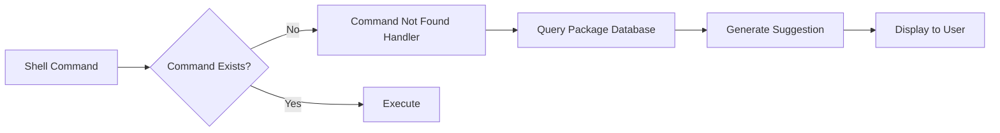

## Overview

Command Not Found is a shell integration utility that provides intelligent command suggestions when you type a command that doesn't exist in your system. It works with PowerShell and Command Prompt to suggest package installations, similar to the "command-not-found" feature in Linux distributions.

<Info>
This utility integrates with Windows Package Manager (winget) to provide installation recommendations.
</Info>

## Activation

<Steps>
  <Step title="Enable in PowerToys">
    Open PowerToys Settings and enable **Command Not Found**
  </Step>
  
  <Step title="Shell Integration">
    The utility automatically integrates with your shells (PowerShell, CMD)
  </Step>
  
  <Step title="Use Naturally">
    Type commands in your terminal - suggestions appear automatically for unknown commands
  </Step>
</Steps>

## Key Features

### Intelligent Command Suggestions

<CardGroup cols={2}>
  <Card title="Package Detection" icon="box">
    Identifies which package contains the missing command
    
    Uses winget package database
  </Card>
  
  <Card title="Installation Commands" icon="terminal">
    Provides exact winget command to install
    
    Copy-paste ready installation
  </Card>
  
  <Card title="Multi-Shell Support" icon="window">
    Works in PowerShell and Command Prompt
    
    Automatic integration on enable
  </Card>
  
  <Card title="Similar Commands" icon="magnifying-glass">
    Suggests similar available commands
    
    Helps with typos and close matches
  </Card>
</CardGroup>

### How It Works

When you type a command that doesn't exist:

```powershell
# Example: Trying to use 'wget' (not installed)
PS C:\> wget https://example.com
wget : The term 'wget' is not recognized as the name of a cmdlet...

Suggestion: Command 'wget' not found, but can be installed with:
  winget install GNU.Wget
```

### Shell Integration

Command Not Found integrates with Windows shells through:

- **PowerShell Profile**: Adds suggestion handler to `$PROFILE`
- **Command Prompt**: Registers command processor extension
- **Automatic Updates**: Keeps suggestion database current

## Configuration

### Enabling/Disabling

<Steps>
  <Step title="Open PowerToys Settings">
    Launch PowerToys Settings application
  </Step>
  
  <Step title="Navigate to Command Not Found">
    Find Command Not Found in the utilities list
  </Step>
  
  <Step title="Toggle State">
    Enable or disable the utility with the toggle switch
  </Step>
</Steps>

<Warning>
Changes to shell integration may require restarting your terminal sessions.
</Warning>

### Supported Shells

<Tabs>
  <Tab title="PowerShell">
    Full integration with PowerShell 5.1 and PowerShell 7+
    
    Suggestions appear automatically after "command not found" errors
  </Tab>
  
  <Tab title="Command Prompt">
    Basic integration with cmd.exe
    
    Provides installation suggestions for missing commands
  </Tab>
  
  <Tab title="Windows Terminal">
    Works seamlessly with Windows Terminal
    
    Supports all integrated shells
  </Tab>
</Tabs>

## Use Cases

### Installing Development Tools

<AccordionGroup>
  <Accordion title="Quick Tool Installation">
    When you need a tool you don't have installed:
    
    ```powershell
    PS C:\> ffmpeg -version
    # Suggestion: winget install Gyan.FFmpeg
    PS C:\> winget install Gyan.FFmpeg
    ```
    
    Common tools:
    - `git` → `winget install Git.Git`
    - `python` → `winget install Python.Python.3.12`
    - `node` → `winget install OpenJS.NodeJS`
    - `docker` → `winget install Docker.DockerDesktop`
  </Accordion>
  
  <Accordion title="Following Tutorials">
    When following online tutorials that assume tool availability:
    
    1. Tutorial says: "Run `kubectl get pods`"
    2. You type the command
    3. Command Not Found suggests: `winget install Kubernetes.kubectl`
    4. Install and continue tutorial
  </Accordion>
  
  <Accordion title="Cross-Platform Scripts">
    Running scripts written for Linux on Windows:
    
    ```bash
    # Script calls 'curl'
    PS C:\> curl https://api.example.com
    # If not available: winget install cURL.cURL
    ```
  </Accordion>
</AccordionGroup>

### Typo Correction

```powershell
# Typo in command
PS C:\> gti status
gti : The term 'gti' is not recognized...

Suggestion: Did you mean 'git'?
  git is available at: C:\Program Files\Git\cmd\git.exe
```

### Package Discovery

<Steps>
  <Step title="Try Command">
    Type a command you think should exist
    
    ```powershell
    PS C:\> terraform version
    ```
  </Step>
  
  <Step title="Get Suggestion">
    Command Not Found suggests package
    
    ```plaintext
    Suggestion: winget install Hashicorp.Terraform
    ```
  </Step>
  
  <Step title="Install & Use">
    Install the package and run your command
    
    ```powershell
    PS C:\> winget install Hashicorp.Terraform
    PS C:\> terraform version
    ```
  </Step>
</Steps>

### Learning New Tools

<CardGroup cols={2}>
  <Card title="Exploration">
    Try commands mentioned in documentation to see if they're available
  </Card>
  
  <Card title="Package Names">
    Learn the official winget package IDs for tools
  </Card>
  
  <Card title="Alternatives">
    Discover alternative tools when suggestions show multiple options
  </Card>
  
  <Card title="Dependencies">
    Identify missing dependencies for complex software
  </Card>
</CardGroup>

## Technical Details

### Architecture



### Database Integration

Command Not Found integrates with Windows Package Manager:

- **Package Index**: Local cache of winget package data
- **Command Mapping**: Database of commands to packages
- **Fuzzy Matching**: Suggests similar commands for typos
- **Update Mechanism**: Periodically refreshes package information

### Module Interface

Minimal implementation for shell integration:

```cpp
// Module interface implementation
// Location: src/modules/cmdNotFound/CmdNotFoundModuleInterface/

class CmdNotFoundModule : public PowertoyModuleIface
{
public:
    virtual void enable() override;
    virtual void disable() override;
    virtual bool is_enabled() override;
};
```

**Source reference:** `src/modules/cmdNotFound/CmdNotFoundModuleInterface/dllmain.cpp`

### Shell Profile Modifications

When enabled, Command Not Found modifies shell profiles:

**PowerShell:**
```powershell
# Added to $PROFILE
Register-ArgumentCompleter -CommandName 'winget' -ScriptBlock {
    # Winget completion logic
}

# Command not found handler
$ExecutionContext.InvokeCommand.CommandNotFoundAction = {
    param($CommandName, $CommandLookupEventArgs)
    # Suggestion logic
}
```

**Location:** `$PROFILE` (typically `~\Documents\PowerShell\Microsoft.PowerShell_profile.ps1`)

## Troubleshooting

<AccordionGroup>
  <Accordion title="Suggestions not appearing">
    **Check:**
    - Command Not Found is enabled in PowerToys Settings
    - Terminal session started after enabling utility
    - PowerShell profile loaded correctly
    
    **Verify profile:**
    ```powershell
    Test-Path $PROFILE
    Get-Content $PROFILE | Select-String "CommandNotFoundAction"
    ```
  </Accordion>
  
  <Accordion title="Wrong package suggestions">
    **Possible causes:**
    - Outdated package database
    - Multiple packages provide same command
    
    **Solutions:**
    1. Update winget: `winget upgrade`
    2. Check alternative packages: `winget search <command>`
    3. Refresh Command Not Found database (restart PowerToys)
  </Accordion>
  
  <Accordion title="Shell integration broken after update">
    **Fix:**
    1. Disable Command Not Found in PowerToys
    2. Restart PowerToys
    3. Re-enable Command Not Found
    4. Restart terminal sessions
    
    This resets shell integration hooks
  </Accordion>
  
  <Accordion title="Conflicts with other command handlers">
    If you have other "command not found" handlers:
    
    1. Check PowerShell profile for conflicts
    2. Ensure Command Not Found handler runs last
    3. Consider disabling other handlers
    
    **Profile inspection:**
    ```powershell
    code $PROFILE
    # Look for multiple CommandNotFoundAction assignments
    ```
  </Accordion>
</AccordionGroup>

## See Also

- [PowerToys Run](/utilities/powertoys-run) - Quick application launcher
- [Command Palette](/utilities/command-palette) - Command execution interface
- [Windows Terminal](https://aka.ms/terminal) - Modern terminal application
