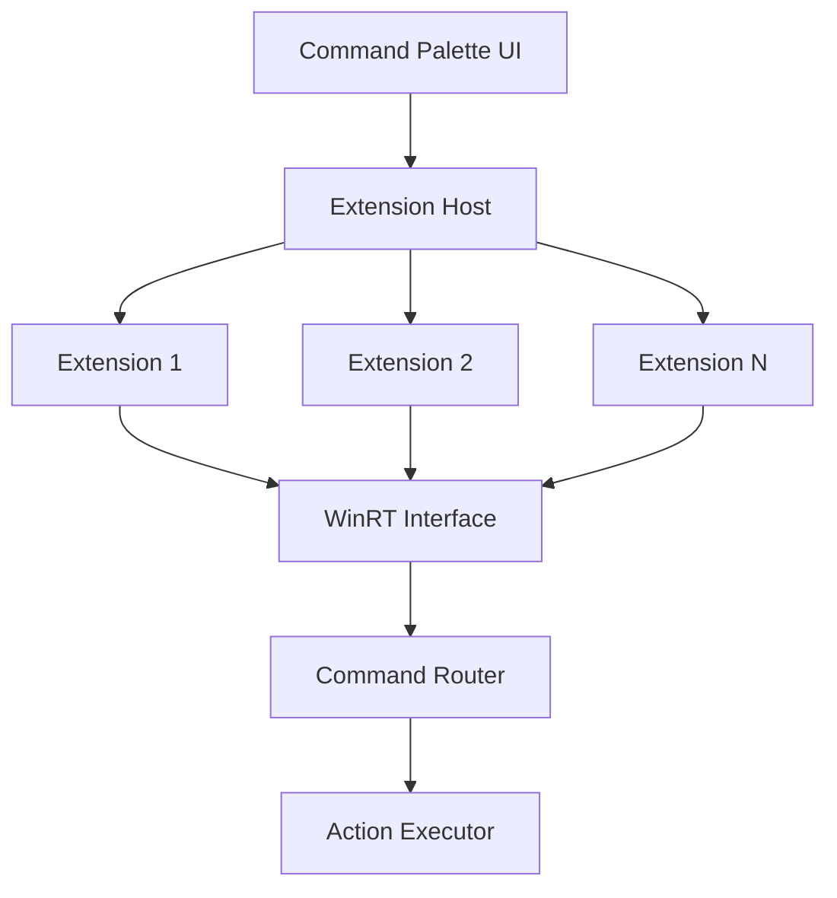

## Overview

Command Palette (CmdPal) is an extensible, modern command launcher that serves as the next iteration of PowerToys Run. With extensibility at its core, it provides a unified interface to start anything, run commands, and interact with system features through a plugin architecture.

<Warning>
Command Palette is currently in **preview**. The API may introduce breaking changes before reaching v1.0.0 stability.
</Warning>

## Activation

<Steps>
  <Step title="Enable Command Palette">
    Open PowerToys Settings and enable **Command Palette**
  </Step>
  
  <Step title="Open Launcher">
    Press the activation shortcut: **`Win+Alt+Space`** (default)
  </Step>
  
  <Step title="Start Typing">
    Enter commands, search queries, or action triggers
  </Step>
</Steps>

## Key Features

### Extensible Architecture

<CardGroup cols={2}>
  <Card title="Extension System" icon="puzzle-piece">
    WinRT-based plugin interface
    
    Language-agnostic extension development
  </Card>
  
  <Card title="Command Providers" icon="code">
    Custom command sources
    
    Integrate any data or action
  </Card>
  
  <Card title="Page Extensions" icon="window">
    Full UI extensions
    
    Custom interfaces within palette
  </Card>
  
  <Card title="Native Integration" icon="link">
    Built-in PowerToys commands
    
    System-level integration
  </Card>
</CardGroup>

### Extension Development

Create extensions in any language supporting WinRT:

```csharp
// Example C# extension structure
using Microsoft.CommandPalette.Extensions;

public class MyExtension : ICmdPalExtension
{
    public string DisplayName => "My Extension";
    public string Description => "Custom functionality";
    
    public IListPage GetListPage()
    {
        // Return command list
    }
    
    public IEnumerable<ICommandItem> GetCommands(string query)
    {
        // Return matching commands
    }
}
```

**API Documentation:** [Microsoft Learn - Command Palette Extensibility](https://learn.microsoft.com/windows/powertoys/command-palette/extensibility-overview)

### Built-in Features

Command Palette includes these capabilities out of the box:

<Tabs>
  <Tab title="Application Launcher">
    - Launch installed applications
    - Search Start Menu items
    - Open UWP and Win32 apps
    - Recent app suggestions
  </Tab>
  
  <Tab title="File Search">
    - Find files and folders
    - Recent documents
    - Quick file actions
    - Path navigation
  </Tab>
  
  <Tab title="Calculator">
    - Inline calculations
    - Mathematical expressions
    - Unit conversions
    - Result clipboard copy
  </Tab>
  
  <Tab title="System Commands">
    - Windows settings shortcuts
    - PowerToys utility actions
    - System utilities
    - Power options
  </Tab>
</Tabs>

### Creating Extensions

The fastest way to create an extension:

<Steps>
  <Step title="Run Create Command">
    Open Command Palette and run **"Create extension"**
  </Step>
  
  <Step title="Provide Details">
    Enter project name, display name, and output directory
  </Step>
  
  <Step title="Open Solution">
    Navigate to the generated `.sln` file and open in Visual Studio
  </Step>
  
  <Step title="Build & Deploy">
    Build the project - it automatically deploys to Command Palette
  </Step>
</Steps>

## Configuration

### Activation Shortcut

<ParamField path="activation_shortcut" type="hotkey" default="Win+Alt+Space">
  Global hotkey to open Command Palette
  
  Configurable in PowerToys Settings
</ParamField>

### Extension Management

Manage installed extensions:

1. Open Command Palette
2. Type "extensions" or "plugins"
3. View installed extensions
4. Enable/disable individual extensions
5. Configure extension settings

### Search Behavior

<ParamField path="max_results" type="number" default="10">
  Maximum number of results to display
</ParamField>

<ParamField path="search_delay_ms" type="number" default="150">
  Debounce delay for search queries (milliseconds)
</ParamField>

<ParamField path="fuzzy_matching" type="boolean" default="true">
  Enable fuzzy search for command matching
</ParamField>

## Use Cases

### Quick Actions

<AccordionGroup>
  <Accordion title="Launch Applications">
    Fastest way to open applications:
    
    ```plaintext
    1. Press Win+Alt+Space
    2. Type: "vscode"
    3. Press Enter
    → Visual Studio Code opens
    ```
  </Accordion>
  
  <Accordion title="Calculations">
    Quick math without opening calculator:
    
    ```plaintext
    Win+Alt+Space → "= 1234 * 56" → Enter to copy result
    ```
  </Accordion>
  
  <Accordion title="File Navigation">
    Jump to files and folders:
    
    ```plaintext
    Win+Alt+Space → "documents\report" → Open location
    ```
  </Accordion>
</AccordionGroup>

### Developer Workflows

<CodeGroup>
```plaintext Quick Repository Access
# Custom extension for Git repos
Win+Alt+Space
→ "repo project-name"
→ Opens in VS Code
```

```plaintext Build Commands
# Extension for build tasks
Win+Alt+Space
→ "build release"
→ Runs build script
```

```plaintext Docker Management
# Docker extension commands
Win+Alt+Space
→ "docker ps"
→ Shows container list
```
</CodeGroup>

### System Management

<CardGroup cols={2}>
  <Card title="Settings Access">
    Quick access to Windows settings
    
    `Win+Alt+Space → "settings display"`
  </Card>
  
  <Card title="PowerToys Control">
    Manage PowerToys utilities
    
    `Win+Alt+Space → "powertoys color picker"`
  </Card>
  
  <Card title="Process Management">
    Extension for task management
    
    Custom commands for process control
  </Card>
  
  <Card title="Power Options">
    Quick power commands
    
    Shutdown, restart, sleep actions
  </Card>
</CardGroup>

### Custom Integrations

Examples of custom extensions:

- **API Testing**: Quick REST API calls
- **Cloud Services**: Interact with Azure, AWS, etc.
- **Database Queries**: Run quick database lookups
- **Documentation**: Search local documentation
- **Snippets**: Insert code snippets
- **DevOps**: Trigger CI/CD pipelines

## Extension Development

### Getting Started

<Steps>
  <Step title="Install Prerequisites">
    - Visual Studio 2022+ with C++ and .NET workloads
    - Windows SDK 10.0.26100.0+
    - PowerToys installed
  </Step>
  
  <Step title="Create Extension Project">
    Use the "Create extension" command in Command Palette
    
    Or manually with project template
  </Step>
  
  <Step title="Implement Interface">
    Implement `ICmdPalExtension` interface:
    
    ```csharp
    public class MyExtension : ICmdPalExtension
    {
        public string DisplayName { get; }
        public IExtensionIcon Icon { get; }
        public IListPage GetPage() { }
    }
    ```
  </Step>
  
  <Step title="Build & Test">
    Build project - extension auto-deploys to Command Palette
    
    Test immediately in running instance
  </Step>
</Steps>

### Extension Types

<Tabs>
  <Tab title="Command Providers">
    Provide searchable commands:
    
    ```csharp
    public class MyCommandProvider : ICommandProvider
    {
        public IEnumerable<ICommandItem> GetCommands(string query)
        {
            // Return matching commands
            yield return new CommandItem
            {
                Name = "My Command",
                Description = "Does something",
                Icon = myIcon,
                Action = () => ExecuteCommand()
            };
        }
    }
    ```
  </Tab>
  
  <Tab title="Page Extensions">
    Full UI pages within Command Palette:
    
    ```csharp
    public class MyPage : IListPage
    {
        public string PageName => "My Custom Page";
        
        public IList<IListItem> GetItems()
        {
            // Return list items with custom UI
        }
        
        public void OnItemInvoked(IListItem item)
        {
            // Handle item selection
        }
    }
    ```
  </Tab>
  
  <Tab title="Form Pages">
    Input forms for complex commands:
    
    ```csharp
    public class MyFormPage : IFormPage
    {
        public IList<IFormField> GetFields()
        {
            return new List<IFormField>
            {
                new TextBoxField { Label = "Name" },
                new DropdownField { Label = "Type" }
            };
        }
        
        public void OnSubmit(IFormData data)
        {
            // Process form data
        }
    }
    ```
  </Tab>
</Tabs>

### Extension Packaging

Package and distribute extensions:

```xml
<!-- Extension manifest -->
<Package>
  <Identity Name="MyExtension" Version="1.0.0" />
  <DisplayName>My Command Palette Extension</DisplayName>
  <Description>Custom commands for X</Description>
  <Dependencies>
    <TargetDeviceFamily Name="Windows.Desktop" />
  </Dependencies>
</Package>
```

### Sample Extensions

**Official samples in repository:**
- Generic samples: `src/modules/cmdpal/ext/SamplePagesExtension`
- Real-world samples: `src/modules/cmdpal/ext/ProcessMonitorExtension`
- Shipped extensions: [GitHub - CmdPalExtensions](https://github.com/zadjii/CmdPalExtensions)

**Source reference:** `src/modules/cmdpal/README.md:48`

## Technical Details

### Architecture



### Key Projects

| Project | Purpose |
|---------|---------|
| `Microsoft.CmdPal.UI` | Main Command Palette application |
| `Microsoft.CommandPalette.Extensions` | Extension interface (language-agnostic WinRT) |
| `Microsoft.CommandPalette.Extensions.Toolkit` | C# helper library for extensions |
| `SampleExtensions/*` | Example extension implementations |

**Build location:** `src/modules/cmdpal`

### Extension SDK

The extension interface is designed to be language-agnostic:

```cpp
// WinRT interface allows implementation in:
// - C#
// - C++/WinRT
// - Rust (with windows-rs)
// - Python (with pythonnet)
// Any language with WinRT support
```

**SDK Spec:** `src/modules/cmdpal/doc/initial-sdk-spec/initial-sdk-spec.md`

### Extension Discovery

Command Palette discovers extensions through:

1. **Installation Directory**: `%LOCALAPPDATA%\Microsoft\PowerToys\CommandPalette\Extensions`
2. **Package Registration**: Windows package registration
3. **Development Mode**: Direct DLL loading for debugging

## Keyboard Shortcuts

### Global

| Shortcut | Action |
|----------|--------|
| `Win+Alt+Space` | Open Command Palette (default) |

### In Command Palette

| Shortcut | Action |
|----------|--------|
| `Type to search` | Filter commands |
| `↑` / `↓` | Navigate results |
| `Enter` | Execute selected command |
| `Esc` | Close Command Palette |
| `Tab` | Auto-complete / Next field |
| `Shift+Enter` | Alternative action (if available) |
| `Ctrl+[Number]` | Quick select result |

## Troubleshooting

<AccordionGroup>
  <Accordion title="Command Palette won't open">
    **Check:**
    - PowerToys is running
    - Command Palette enabled in settings
    - Shortcut not conflicting
    
    **Debug:**
    - Check PowerToys logs
    - Try alternate activation shortcut
    - Restart PowerToys
  </Accordion>
  
  <Accordion title="Extension not loading">
    **Verify:**
    1. Extension built successfully
    2. Extension in correct directory
    3. Extension manifest valid
    4. Dependencies installed
    
    **Location:** `%LOCALAPPDATA%\Microsoft\PowerToys\CommandPalette\Extensions`
    
    **Logs:** Check Command Palette logs for load errors
  </Accordion>
  
  <Accordion title="Extension crashes Command Palette">
    **Steps:**
    1. Disable extension
    2. Review extension error handling
    3. Check exception logs
    4. Debug extension in Visual Studio
    
    **Best practices:**
    - Wrap extension code in try-catch
    - Validate all inputs
    - Handle async operations properly
  </Accordion>
  
  <Accordion title="Search results not appearing">
    **Check:**
    - Extension implementing search correctly
    - Query parsing logic
    - Result filtering
    - Performance (timeout issues)
    
    **Performance tip:** Return results quickly, use async for slow operations
  </Accordion>
</AccordionGroup>

## See Also

- [PowerToys Run](/utilities/powertoys-run) - Previous generation launcher
- [Extension Development Guide](https://learn.microsoft.com/windows/powertoys/command-palette/extensibility-overview)
- [Sample Extensions](https://github.com/zadjii/CmdPalExtensions)
- [Command Not Found](/utilities/command-not-found) - Shell integration
