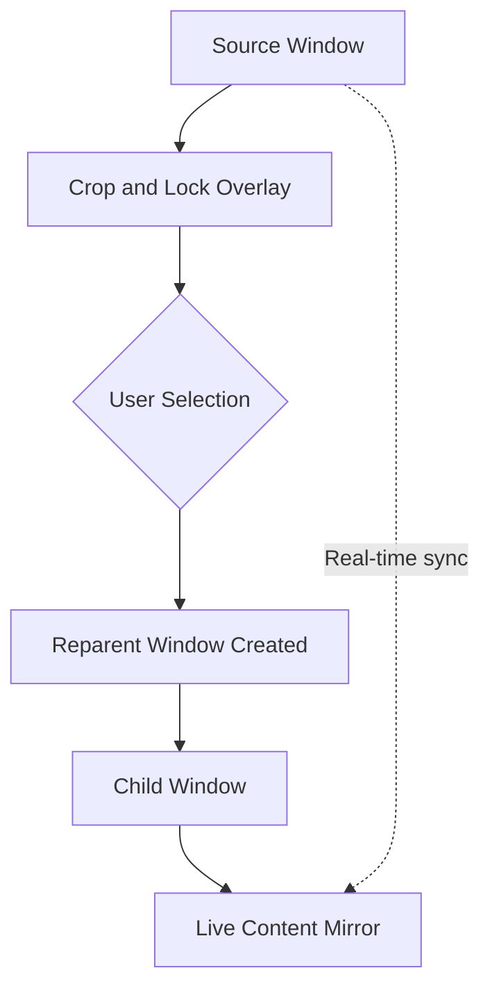

## Overview

Crop and Lock allows you to crop any window to display only a specific region of its content. The cropped area becomes an independent, always-visible window that updates in real-time with the source window, perfect for monitoring specific UI elements or data while working in other applications.

<Info>
Cropped windows remain synchronized with their source windows, updating in real-time as the source content changes.
</Info>

## Activation

<Steps>
  <Step title="Enable Crop and Lock">
    Open PowerToys Settings and enable **Crop and Lock**
  </Step>
  
  <Step title="Select Window to Crop">
    Focus the window you want to crop
  </Step>
  
  <Step title="Trigger Crop Mode">
    Press the activation shortcut (default: `Win+Ctrl+Shift+T`) to enter crop mode
  </Step>
  
  <Step title="Select Region">
    Click and drag to select the area you want to crop
  </Step>
  
  <Step title="Confirm Selection">
    Release mouse button to create the cropped window
  </Step>
</Steps>

## Key Features

### Window Cropping

<CardGroup cols={2}>
  <Card title="Interactive Selection" icon="crop">
    Click and drag to select any region
    
    Visual overlay shows selection area
  </Card>
  
  <Card title="Real-Time Updates" icon="sync">
    Cropped window mirrors source content
    
    Live synchronization
  </Card>
  
  <Card title="Independent Window" icon="window">
    Cropped area becomes separate window
    
    Can be moved and positioned anywhere
  </Card>
  
  <Card title="Reparenting" icon="sitemap">
    Window reparenting for content capture
    
    Maintains connection to source
  </Card>
</CardGroup>

### Window Management

Cropped windows are fully manageable:

```cpp
// Reparenting implementation (ReparentCropAndLockWindow.cpp:23)
ReparentCropAndLockWindow::ReparentCropAndLockWindow(
    std::wstring const& titleString, 
    int width, 
    int height)
{
    // Create independent window with WS_OVERLAPPEDWINDOW style
    auto style = WS_OVERLAPPEDWINDOW | WS_CLIPCHILDREN;
    style &= ~(WS_MAXIMIZEBOX | WS_THICKFRAME);
    
    CreateWindowExW(exStyle, ClassName.c_str(), titleString.c_str(), 
                    style, CW_USEDEFAULT, CW_USEDEFAULT, 
                    adjustedWidth, adjustedHeight, nullptr, nullptr, 
                    instance, this);
    
    m_childWindow = std::make_unique<ChildWindow>(width, height, m_window);
}
```

**Features:**
- Non-resizable by default (no maximize/resize borders)
- Can be moved freely
- Always on top behavior
- Maintains aspect ratio of cropped region

### Overlay Selection Interface

When crop mode is activated:

1. **Visual Overlay**: Semi-transparent overlay covers the window
2. **Selection Rectangle**: Drag to define crop region
3. **Real-time Preview**: See selected area highlighted
4. **Escape to Cancel**: Press `Esc` to cancel without cropping

### Focus Management

```cpp
// Focus handling (ReparentCropAndLockWindow.cpp:62)
case WM_MOUSEACTIVATE:
    if (m_currentTarget != nullptr && 
        GetForegroundWindow() != m_currentTarget)
    {
        SetForegroundWindow(m_currentTarget);
    }
    return MA_NOACTIVATE;

case WM_ACTIVATE:
    if (static_cast<DWORD>(wparam) == WA_ACTIVE)
    {
        if (m_currentTarget != nullptr)
        {
            SetForegroundWindow(m_currentTarget);
        }
    }
    break;
```

Cropped windows don't steal focus from the source window, maintaining seamless workflow.

## Configuration

### Activation Shortcut

<ParamField path="activation_shortcut" type="hotkey" default="Win+Ctrl+Shift+T">
  Global hotkey to enter crop mode
  
  Configurable in PowerToys Settings
</ParamField>

### Crop Behavior

No additional configuration options currently available. The utility provides straightforward crop-and-display functionality.

## Use Cases

### Monitoring Dashboard Widgets

<AccordionGroup>
  <Accordion title="System Resource Monitoring">
    Crop Task Manager's performance graph:
    
    ```plaintext
    1. Open Task Manager
    2. Switch to Performance tab
    3. Press Win+Ctrl+Shift+T
    4. Select CPU graph area
    5. Position cropped window in corner
    → Always-visible CPU monitoring
    ```
  </Accordion>
  
  <Accordion title="Build Status Tracking">
    Monitor CI/CD dashboard status:
    
    1. Open build dashboard in browser
    2. Crop the build status section
    3. Keep visible while coding
    4. Instantly see build failures
  </Accordion>
  
  <Accordion title="Stock Ticker">
    Keep eye on stock prices:
    
    - Crop stock price widget from trading platform
    - Position on secondary monitor
    - Monitor prices while working
  </Accordion>
</AccordionGroup>

### Video Conferencing

<Steps>
  <Step title="Crop Meeting Controls">
    Crop Zoom/Teams control panel from main meeting window
  </Step>
  
  <Step title="Position on Screen">
    Place cropped controls in accessible location
  </Step>
  
  <Step title="Full Screen Presentation">
    Share screen full screen, controls remain accessible
  </Step>
  
  <Step title="Mute/Unmute Easily">
    Use cropped controls without switching windows
  </Step>
</Steps>

### Reference Material

<CardGroup cols={2}>
  <Card title="Code Examples">
    Crop documentation example while coding
    
    Keep reference visible on screen
  </Card>
  
  <Card title="Design Specifications">
    Crop design specs section
    
    Reference while implementing features
  </Card>
  
  <Card title="Chat Messages">
    Crop important chat conversation
    
    Monitor specific discussion thread
  </Card>
  
  <Card title="Terminal Output">
    Crop log section from terminal
    
    Watch for specific log messages
  </Card>
</CardGroup>

### Multi-Application Workflows

<Tabs>
  <Tab title="Trading">
    Crop multiple charts from trading platform:
    
    1. Crop price chart
    2. Crop order book
    3. Crop portfolio summary
    4. Arrange cropped windows on screen
    5. Custom trading dashboard from single app
  </Tab>
  
  <Tab title="Video Editing">
    Monitor timeline while working in effects panel:
    
    - Crop video timeline
    - Work in effects/color panel full screen
    - Timeline remains visible for timing reference
  </Tab>
  
  <Tab title="Data Analysis">
    Keep key metrics visible:
    
    - Crop summary statistics table
    - Work with raw data in full window
    - Reference statistics while exploring data
  </Tab>
</Tabs>

### Gaming & Streaming

<AccordionGroup>
  <Accordion title="Game Overlays">
    Create custom overlays from game UI:
    
    - Crop minimap from strategy game
    - Crop resource counters
    - Crop chat window
    - Arrange as custom HUD on secondary monitor
  </Accordion>
  
  <Accordion title="Stream Monitoring">
    For streamers:
    
    - Crop streaming software stats (bitrate, FPS)
    - Crop chat window
    - Crop donation alerts
    - Monitor while gaming full screen
  </Accordion>
</AccordionGroup>

## Technical Details

### Architecture



### Window Hierarchy

```plaintext
Reparent Window (Independent)
  └─ Child Window (Content Container)
      └─ Source Window Content (Mirrored)
```

The implementation uses three window layers:

1. **ReparentCropAndLockWindow**: Top-level independent window
2. **ChildWindow**: Container for captured content
3. **Content Mirror**: Real-time display of source window region

### Window Styles

```cpp
// Window creation styles (ReparentCropAndLockWindow.cpp:30)
auto style = WS_OVERLAPPEDWINDOW | WS_CLIPCHILDREN;
style &= ~(WS_MAXIMIZEBOX | WS_THICKFRAME);

// Behaviors:
// WS_OVERLAPPEDWINDOW: Standard window with title bar
// WS_CLIPCHILDREN: Prevent parent drawing over child
// ~WS_MAXIMIZEBOX: No maximize button
// ~WS_THICKFRAME: No resize borders
```

### Content Synchronization

Real-time mirroring mechanism:

- **DWM Integration**: Uses Desktop Window Manager for content capture
- **Update Rate**: Synchronized with source window refresh
- **Performance**: Minimal CPU overhead, GPU-accelerated

### Key Components

| Component | Purpose | File |
|-----------|---------|------|
| `ReparentCropAndLockWindow` | Main window container | `src/modules/CropAndLock/CropAndLock/ReparentCropAndLockWindow.cpp` |
| `ChildWindow` | Content display surface | `src/modules/CropAndLock/CropAndLock/ChildWindow.cpp` |
| `OverlayWindow` | Selection interface | `src/modules/CropAndLock/CropAndLock/OverlayWindow.cpp` |

## Keyboard Shortcuts

### Global

| Shortcut | Action |
|----------|--------|
| `Win+Ctrl+Shift+T` | Enter crop mode (default) |

### During Crop Selection

| Shortcut | Action |
|----------|--------|
| `Click + Drag` | Select crop region |
| `Esc` | Cancel crop operation |
| `Release Mouse` | Confirm selection and create cropped window |

### Managing Cropped Windows

| Action | Method |
|--------|--------|
| **Move** | Drag title bar |
| **Close** | Click X button or Alt+F4 |
| **Always on Top** | Use Always On Top utility on cropped window |

<Tip>
Combine Crop and Lock with [Always On Top](/utilities/always-on-top) to ensure cropped windows stay visible above all other windows.
</Tip>

## Troubleshooting

<AccordionGroup>
  <Accordion title="Crop mode doesn't activate">
    **Check:**
    - Crop and Lock is enabled in PowerToys Settings
    - Target window is in focus
    - Shortcut not conflicting with other applications
    - PowerToys is running
    
    **Test:**
    - Try different target windows
    - Verify shortcut in PowerToys Settings
    - Restart PowerToys
  </Accordion>
  
  <Accordion title="Cropped window shows black/blank">
    **Possible causes:**
    - Source window using protected content (DRM)
    - Graphics driver issues
    - Source window minimized or hidden
    
    **Solutions:**
    1. Ensure source window is visible and unminimized
    2. Update graphics drivers
    3. Some content (e.g., video players with DRM) cannot be cropped
  </Accordion>
  
  <Accordion title="Content not updating in cropped window">
    **Troubleshooting:**
    - Check if source window is still open
    - Verify source window is not minimized
    - Close and recreate crop if sync is lost
    
    **Note:** If source window closes, cropped window shows last captured frame
  </Accordion>
  
  <Accordion title="Cannot select region in crop mode">
    **Verify:**
    - Mouse cursor is over the target window
    - Window is not obscured by other windows
    - Graphics acceleration is enabled
    
    **Workaround:** Try cropping a different window to test functionality
  </Accordion>
  
  <Accordion title="Cropped window has wrong DPI scaling">
    **For high-DPI displays:**
    - Cropped content should match source DPI
    - If blurry, check display scaling settings
    - Ensure PowerToys is DPI-aware
    
    **Windows Settings:**
    System > Display > Scale and layout
  </Accordion>
</AccordionGroup>

## Limitations

<Warning>
**Content Protection:** Some windows cannot be cropped due to content protection:

- DRM-protected video players
- Secure input fields (passwords)
- Some fullscreen games with anti-cheat
- Banking/financial application secure areas

These windows may show black or blank content in cropped windows.
</Warning>

### Performance Considerations

- **Multiple Crops**: Many cropped windows may impact performance
- **Large Regions**: Larger crop areas use more GPU memory
- **High Refresh Rate**: Source windows updating frequently may increase GPU usage

<Tip>
**Best Practices:**
- Crop only necessary portions (smaller is better)
- Close cropped windows when no longer needed
- Limit simultaneous crops to 3-5 for best performance
</Tip>

## See Also

- [Always On Top](/utilities/always-on-top) - Keep cropped windows on top
- [FancyZones](/utilities/fancyzones) - Organize multiple windows including crops
- [PowerToys Run](/utilities/powertoys-run) - Quick window management
