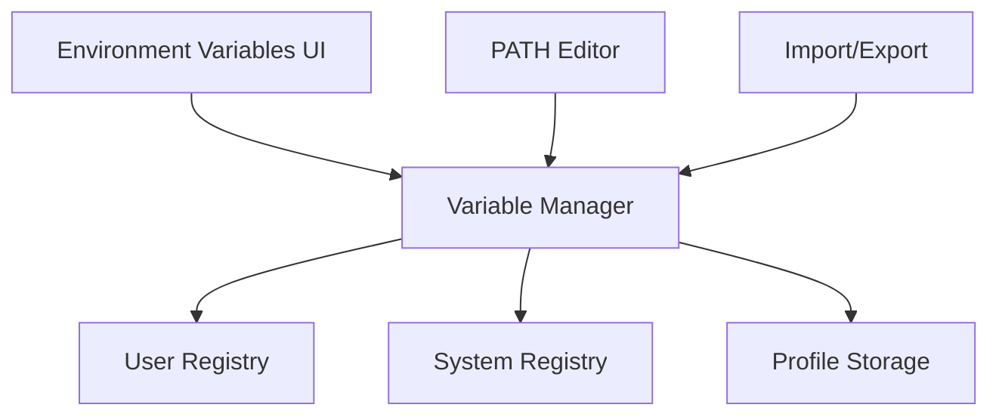

## Overview

Environment Variables provides a modern, user-friendly interface for managing Windows environment variables. It offers advanced features like profile management, bulk editing, and easy variable creation/modification, making it much easier than the built-in Windows environment variable editor.

<Tip>
Changes to environment variables take effect immediately for new processes, but existing applications need to be restarted to see the changes.
</Tip>

## Activation

<Steps>
  <Step title="Enable Environment Variables">
    Open PowerToys Settings and enable **Environment Variables**
  </Step>
  
  <Step title="Launch Editor">
    Open via PowerToys Settings or use the activation shortcut (if configured)
  </Step>
  
  <Step title="Select Scope">
    Choose between User or System environment variables
  </Step>
</Steps>

## Key Features

### Graphical Variable Editor

<CardGroup cols={2}>
  <Card title="User Variables" icon="user">
    Manage variables for current user only
    
    No admin privileges required
  </Card>
  
  <Card title="System Variables" icon="server">
    Manage system-wide variables
    
    Requires administrator privileges
  </Card>
  
  <Card title="Variable Profiles" icon="layer-group">
    Create and switch between variable sets
    
    Perfect for different development environments
  </Card>
  
  <Card title="PATH Editor" icon="route">
    Dedicated interface for PATH variable
    
    Add, remove, reorder entries easily
  </Card>
</CardGroup>

### Profile Management

Create variable profiles for different scenarios:

```csharp
// Profile functionality allows switching contexts
// Example: Development, Testing, Production profiles

public class EnvironmentProfile
{
    public string Name { get; set; }
    public Dictionary<string, string> Variables { get; set; }
    public bool IsEnabled { get; set; }
}
```

**Use cases:**
- Development vs Production configurations
- Different project environments
- Testing with alternate tool versions
- Multiple SDK versions

### PATH Variable Management

Enhanced PATH editing:

- **Visual List**: See all PATH entries in a list
- **Add Entry**: Click button to add new path
- **Remove Entry**: Delete unused paths
- **Reorder**: Drag entries to change priority
- **Validate**: Check if paths exist
- **Duplicate Detection**: Highlight duplicate entries

### Bulk Operations

<Tabs>
  <Tab title="Import">
    Import variables from file:
    
    ```plaintext
    # variables.env
    API_KEY=your_key_here
    DATABASE_URL=postgres://localhost/mydb
    DEBUG_MODE=true
    ```
    
    Load multiple variables at once
  </Tab>
  
  <Tab title="Export">
    Export current variables:
    
    - Save as .env file
    - Backup before changes
    - Share configurations
    - Version control friendly
  </Tab>
  
  <Tab title="Search">
    Find variables quickly:
    
    - Filter by name
    - Search in values
    - Highlight matches
  </Tab>
</Tabs>

### Variable Validation

Built-in validation features:

```csharp
// PATH validation example
public bool ValidatePathEntry(string path)
{
    // Check if path exists
    if (!Directory.Exists(path) && !File.Exists(path))
    {
        return false; // Mark as invalid
    }
    
    // Check for duplicates
    if (ExistingPaths.Contains(path, StringComparer.OrdinalIgnoreCase))
    {
        return false; // Duplicate found
    }
    
    return true;
}
```

Visual indicators:
- ✓ Green: Valid path
- ⚠ Yellow: Warning (duplicate, spacing issues)
- ✗ Red: Invalid (path doesn't exist)

## Configuration

### Settings Location

Environment variables are stored by Windows in:
- **User**: `HKEY_CURRENT_USER\Environment`
- **System**: `HKEY_LOCAL_MACHINE\SYSTEM\CurrentControlSet\Control\Session Manager\Environment`

Profile configurations stored in:
```
%LOCALAPPDATA%\Microsoft\PowerToys\EnvironmentVariables\
```

### Variable Scopes

<ParamField path="User Variables" type="scope">
  Variables specific to the current user account
  
  - No admin rights needed
  - Stored in user registry hive
  - Affect only current user's processes
</ParamField>

<ParamField path="System Variables" type="scope">
  Variables shared across all users
  
  - Requires administrator privileges
  - Stored in system registry
  - Affect all users and system processes
</ParamField>

### Common Variables

<AccordionGroup>
  <Accordion title="PATH">
    Directories searched for executable files
    
    **Example:**
    ```
    C:\Program Files\Git\cmd
    C:\Python312
    C:\Users\YourName\AppData\Local\Programs\Python\Python312\Scripts
    ```
  </Accordion>
  
  <Accordion title="TEMP / TMP">
    Temporary file directories
    
    **Default:**
    ```
    TEMP=%USERPROFILE%\AppData\Local\Temp
    TMP=%USERPROFILE%\AppData\Local\Temp
    ```
  </Accordion>
  
  <Accordion title="HOME / USERPROFILE">
    User home directory location
    
    **System set:**
    ```
    USERPROFILE=C:\Users\YourName
    HOME=%USERPROFILE%
    ```
  </Accordion>
</AccordionGroup>

## Use Cases

### Development Environment Setup

<Steps>
  <Step title="Add Development Tools to PATH">
    ```plaintext
    1. Open Environment Variables editor
    2. Navigate to PATH variable
    3. Add tool directories:
       - C:\Program Files\nodejs
       - C:\Go\bin
       - C:\Program Files\Git\cmd
    ```
  </Step>
  
  <Step title="Set SDK Variables">
    Create variables for SDK locations:
    
    ```plaintext
    JAVA_HOME=C:\Program Files\Java\jdk-17
    ANDROID_HOME=C:\Android\sdk
    GOPATH=C:\Users\YourName\go
    ```
  </Step>
  
  <Step title="Create Development Profile">
    Save configuration as "Development" profile for easy switching
  </Step>
</Steps>

### Multiple Project Configurations

<CodeGroup>
```plaintext Project A Profile
PROJECT_ROOT=C:\Projects\ProjectA
API_ENDPOINT=https://api.projecta.dev
DATABASE_URL=postgres://localhost/projecta
NODE_ENV=development
```

```plaintext Project B Profile
PROJECT_ROOT=C:\Projects\ProjectB
API_ENDPOINT=https://api.projectb.dev
DATABASE_URL=postgres://localhost/projectb
NODE_ENV=development
```
</CodeGroup>

Switch between projects by changing active profile.

### CI/CD Configuration

<AccordionGroup>
  <Accordion title="Local Testing">
    Match CI environment variables locally:
    
    ```plaintext
    CI=true
    BUILD_NUMBER=local
    GIT_BRANCH=feature/new-feature
    ```
    
    Test build scripts in local environment
  </Accordion>
  
  <Accordion title="Secrets Management">
    Set API keys and tokens:
    
    ```plaintext
    API_KEY=your_development_key
    AWS_ACCESS_KEY_ID=your_key
    AWS_SECRET_ACCESS_KEY=your_secret
    ```
    
    **⚠ Security Note:** Use environment variables for non-production secrets only
  </Accordion>
</AccordionGroup>

### PATH Cleanup

<Steps>
  <Step title="Review Current PATH">
    Open PATH editor and review all entries
  </Step>
  
  <Step title="Identify Issues">
    Look for:
    - Invalid paths (red indicators)
    - Duplicate entries (yellow warnings)
    - Unused applications
  </Step>
  
  <Step title="Clean Up">
    - Remove invalid paths
    - Delete duplicates
    - Uninstall unused applications
    - Reorder by priority
  </Step>
  
  <Step title="Test">
    Open new terminal and verify commands work
  </Step>
</Steps>

### Tool Version Management

<CardGroup cols={2}>
  <Card title="Node.js Versions">
    Switch between Node versions:
    
    ```plaintext
    # Node 18 Profile
    PATH=C:\Program Files\nodejs-18\;...
    
    # Node 20 Profile
    PATH=C:\Program Files\nodejs-20\;...
    ```
  </Card>
  
  <Card title="Python Versions">
    Manage multiple Python installations:
    
    ```plaintext
    # Python 3.11
    PATH=C:\Python311\;C:\Python311\Scripts;...
    
    # Python 3.12
    PATH=C:\Python312\;C:\Python312\Scripts;...
    ```
  </Card>
</CardGroup>

## Technical Details

### Architecture



### Registry Integration

Direct Windows registry manipulation:

```csharp
// Registry access for environment variables
using Microsoft.Win32;

public static void SetUserVariable(string name, string value)
{
    using var key = Registry.CurrentUser.OpenSubKey("Environment", true);
    key?.SetValue(name, value, RegistryValueKind.String);
    
    // Broadcast change to system
    SendMessageTimeout(
        HWND_BROADCAST,
        WM_SETTINGCHANGE,
        IntPtr.Zero,
        "Environment",
        SMTO_ABORTIFHUNG,
        5000,
        out _
    );
}
```

**Source reference:** `src/modules/EnvironmentVariables/EnvironmentVariables/Helpers/NativeMethods.cs`

### Change Broadcasting

Changes are broadcast to all running applications:

```cpp
// WM_SETTINGCHANGE notification
SendMessageTimeout(
    HWND_BROADCAST,                    // All top-level windows
    WM_SETTINGCHANGE,                  // Setting changed message
    0,                                 // wParam (unused)
    (LPARAM)"Environment",            // lParam (what changed)
    SMTO_ABORTIFHUNG,                  // Flags
    5000,                              // Timeout (5 seconds)
    NULL                               // Result (not needed)
);
```

Applications that listen for `WM_SETTINGCHANGE` will reload environment variables.

### Profile Format

Profiles stored as JSON:

```json
{
  "name": "Development",
  "enabled": true,
  "variables": [
    {
      "name": "NODE_ENV",
      "value": "development",
      "type": "User"
    },
    {
      "name": "API_ENDPOINT",
      "value": "https://localhost:3000",
      "type": "User"
    }
  ]
}
```

## Troubleshooting

<AccordionGroup>
  <Accordion title="Changes not taking effect">
    **Environment variables only affect new processes:**
    
    1. Close and reopen terminal/command prompt
    2. Restart application that needs the variables
    3. Log off and log back in (for some system changes)
    4. Restart computer (for system-wide changes)
    
    **Verify:**
    ```powershell
    # In new PowerShell window
    $env:YOUR_VARIABLE_NAME
    ```
  </Accordion>
  
  <Accordion title="Cannot edit system variables">
    **Requires administrator privileges:**
    
    1. Close PowerToys
    2. Right-click PowerToys icon
    3. Select "Run as administrator"
    4. Open Environment Variables editor
    
    **Alternative:** Use built-in Windows editor (requires admin)
  </Accordion>
  
  <Accordion title="PATH too long error">
    **Windows has a PATH length limit (~2048 characters):**
    
    **Solutions:**
    1. Remove unused paths
    2. Use shorter directory names
    3. Use symbolic links for long paths
    4. Set individual tool environment variables instead of adding all to PATH
    
    **Check current length:**
    ```powershell
    $env:PATH.Length
    ```
  </Accordion>
  
  <Accordion title="Variable not found in application">
    **Check scope and process:**
    
    1. Verify variable exists in correct scope (User vs System)
    2. Ensure application restarted after variable set
    3. Check if application runs as different user
    4. Verify no typos in variable name (case-insensitive but must match)
    
    **Debug:**
    ```powershell
    # List all environment variables
    Get-ChildItem Env:
    
    # Check specific variable
    [Environment]::GetEnvironmentVariable("VAR_NAME", "User")
    [Environment]::GetEnvironmentVariable("VAR_NAME", "Machine")
    ```
  </Accordion>
</AccordionGroup>

## See Also

- [PowerToys Run](/utilities/powertoys-run) - Quick environment variable access
- [Command Not Found](/utilities/command-not-found) - Suggests missing PATH entries
- [Windows Terminal](https://aka.ms/terminal) - Modern terminal with environment support
