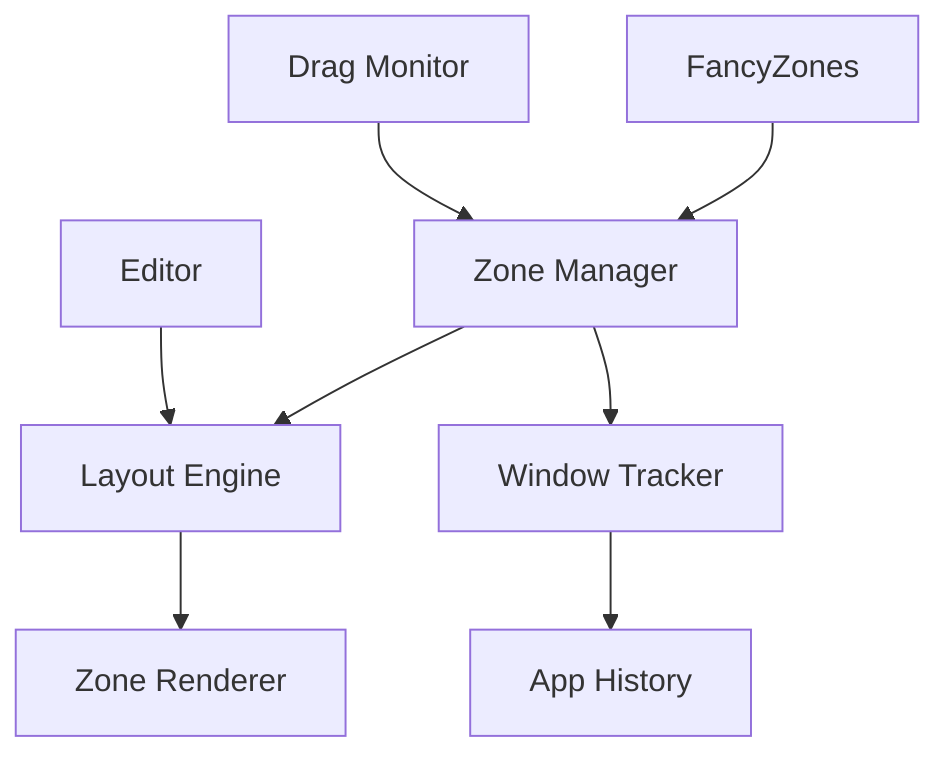

## Overview

FancyZones is a powerful window manager that allows you to create custom window layouts and quickly snap windows into predefined zones. It's perfect for organizing multiple applications across one or more monitors with consistent, efficient layouts.

<Info>
FancyZones can remember where applications were placed and automatically restore them to those zones when reopened.
</Info>

## Activation

<Steps>
  <Step title="Enable FancyZones">
    Open PowerToys Settings and enable **FancyZones**
  </Step>
  
  <Step title="Create Layout">
    Press `Win+Shift+~` to open the layout editor
  </Step>
  
  <Step title="Snap Windows">
    Hold `Shift` while dragging windows to see zone overlays
  </Step>
</Steps>

## Key Features

### Custom Zone Layouts

<CardGroup cols={2}>
  <Card title="Grid Layouts" icon="grid">
    Divide screen into equal grid cells
    
    2x2, 3x3, or custom dimensions
  </Card>
  
  <Card title="Template Layouts" icon="table-columns">
    Pre-designed layouts for common workflows
    
    Focus, Columns, Rows, Priority Grid
  </Card>
  
  <Card title="Custom Layouts" icon="pen-ruler">
    Draw your own zone configurations
    
    Pixel-perfect control
  </Card>
  
  <Card title="Multi-Monitor" icon="display">
    Different layouts per monitor
    
    Independent zone configurations
  </Card>
</CardGroup>

### Window Snapping

Multiple methods to snap windows:

<Tabs>
  <Tab title="Drag with Shift">
    **Primary method:**
    1. Click and start dragging a window
    2. Hold `Shift` key
    3. Zone overlay appears
    4. Drag to desired zone
    5. Release mouse button
    
    Window snaps to zone
  </Tab>
  
  <Tab title="Win + Arrow Keys">
    **Keyboard navigation:**
    
    ```plaintext
    Win+Left  : Snap to left zone
    Win+Right : Snap to right zone
    Win+Up    : Maximize in current zone
    Win+Down  : Restore/minimize
    ```
    
    Cycles through zones with repeated presses
  </Tab>
  
  <Tab title="Zone Number Shortcuts">
    **Direct zone selection:**
    
    While holding `Shift` during drag:
    - Press `1-9` to snap to numbered zone
    - Instant placement without hovering
  </Tab>
</Tabs>

### Layout Editor

Create and customize layouts:

```cpp
// Layout types in FancyZones
enum class ZoneSetLayoutType
{
    Grid,           // Rows × Columns grid
    Columns,        // Vertical columns
    Rows,           // Horizontal rows
    Custom,         // User-defined zones
    Template        // Pre-designed templates
};
```

**Editor features:**
- Visual zone editor
- Drag to resize zones
- Snap zones to edges
- Spacing configuration
- Zone count adjustment
- Color preview

### Zone Behaviors

<ParamField path="Zone Appearance" type="settings">
  Customize how zones look:
  - Zone colors
  - Border thickness
  - Opacity levels
  - Number display
  - Zone highlighting
</ParamField>

<ParamField path="Snapping Behavior" type="settings">
  Control snap mechanics:
  - Snap sensitivity
  - Show zones on drag
  - Move newly created windows to zones
  - Restore zone layouts on relaunch
</ParamField>

<ParamField path="Multi-Monitor" type="settings">
  Per-monitor configuration:
  - Independent layouts per display
  - Move windows between monitors preserves zones
  - Span windows across zones
</ParamField>

### App-Specific Zones

FancyZones remembers window placements:

- **Application History**: Tracks which app was in which zone
- **Auto-Restore**: Reopened apps return to their zones
- **Virtual Desktop Aware**: Different layouts per virtual desktop

## Configuration

### Settings Location

```
%LOCALAPPDATA%\Microsoft\PowerToys\FancyZones\
```

Layout files stored as JSON configurations.

### Core Settings

<ParamField path="editor_hotkey" type="hotkey" default="Win+Shift+`">
  Shortcut to open layout editor
</ParamField>

<ParamField path="move_newly_created_windows" type="boolean" default="false">
  Automatically move new windows to zones
</ParamField>

<ParamField path="move_windows_based_on_position" type="boolean" default="false">
  Snap windows to nearest zone automatically
</ParamField>

<ParamField path="override_snap_hotkeys" type="boolean" default="false">
  Use FancyZones behavior for Win+Arrow keys
</ParamField>

<ParamField path="zone_border_color" type="color" default="#0078D7">
  Color of zone borders in hex format
</ParamField>

<ParamField path="zone_highlight_opacity" type="number" default="50">
  Opacity percentage for zone highlights (0-100)
</ParamField>

<ParamField path="excluded_apps" type="array" default="[]">
  Applications excluded from FancyZones
</ParamField>

<ParamField path="restore_size" type="boolean" default="false">
  Restore window original size when moved out of zone
</ParamField>

### Layout Templates

**Built-in templates:**

<Tabs>
  <Tab title="Focus">
    Large center zone with smaller side panels:
    
    ```plaintext
    ┌────┬────────────┬────┐
    │  1 │      2        │  3 │
    │    │               │    │
    │    │               │    │
    │    │    (Focus)    │    │
    │    │               │    │
    │    │               │    │
    └────┴────────────┴────┘
    ```
  </Tab>
  
  <Tab title="Columns">
    Vertical column layout:
    
    ```plaintext
    ┌─────┬─────┬─────┐
    │     │     │     │
    │     │     │     │
    │  1  │  2  │  3  │
    │     │     │     │
    │     │     │     │
    └─────┴─────┴─────┘
    ```
  </Tab>
  
  <Tab title="Priority Grid">
    Larger primary zone with grid:
    
    ```plaintext
    ┌──────────┬─────┐
    │          │  2  │
    │          ├─────┤
    │    1     │  3  │
    │          ├─────┤
    │          │  4  │
    └──────────┴─────┘
    ```
  </Tab>
</Tabs>

## Use Cases

### Development Workflows

<AccordionGroup>
  <Accordion title="Code + Documentation">
    Side-by-side coding layout:
    
    ```plaintext
    ┌────────────┬────────────┐
    │   VS Code   │    Browser   │
    │   Editor    │     Docs     │
    │            │            │
    ├────────────┴────────────┤
    │      Terminal            │
    └─────────────────────────┘
    ```
  </Accordion>
  
  <Accordion title="Full Stack Development">
    Multi-pane development setup:
    
    1. **Zone 1**: Code editor (60% width)
    2. **Zone 2**: Browser DevTools (40% width, top)
    3. **Zone 3**: Terminal (40% width, bottom)
    
    Snap applications once, reopen automatically in zones
  </Accordion>
  
  <Accordion title="Debugging">
    Debugging layout:
    
    - Large center: Application being debugged
    - Left sidebar: Code editor
    - Right sidebar: Debug console
    - Bottom: Watch variables
  </Accordion>
</AccordionGroup>

### Content Creation

<Steps>
  <Step title="Video Editing">
    Zone 1: Timeline (bottom, full width)
    
    Zone 2: Preview (top left)
    
    Zone 3: Effects/Media browser (top right)
  </Step>
  
  <Step title="Graphic Design">
    Zone 1: Design canvas (center, large)
    
    Zone 2: Layers panel (right)
    
    Zone 3: Color picker/tools (left)
  </Step>
  
  <Step title="Music Production">
    Zone 1: DAW timeline (bottom)
    
    Zone 2: Mixer (right)
    
    Zone 3: VST plugins (left)
  </Step>
</Steps>

### Productivity

<CardGroup cols={2}>
  <Card title="Email + Calendar">
    Split screen for email client and calendar
    
    Quick reference while scheduling
  </Card>
  
  <Card title="Research">
    Multiple browser windows in zones
    
    Compare sources side-by-side
  </Card>
  
  <Card title="Writing">
    Document editor + research materials
    
    Keep references visible while writing
  </Card>
  
  <Card title="Communication">
    Chat apps in dedicated zones
    
    Monitor multiple channels
  </Card>
</CardGroup>

### Multi-Monitor Setups

<Tabs>
  <Tab title="2 Monitors">
    **Monitor 1 (Primary):**
    - Zone 1: Main work application (full)
    
    **Monitor 2 (Secondary):**
    - Zone 1: Reference materials (top)
    - Zone 2: Communication (bottom)
  </Tab>
  
  <Tab title="3+ Monitors">
    **Center Monitor:** Primary application (full screen)
    
    **Left Monitor:** Support tools (split zones)
    
    **Right Monitor:** Communication/monitoring (split zones)
  </Tab>
  
  <Tab title="Vertical Monitor">
    Portrait orientation zones:
    - Top: Documentation
    - Middle: Code editor
    - Bottom: Terminal
    
    Perfect for reading code/documents
  </Tab>
</Tabs>

## Keyboard Shortcuts

### Layout Management

| Shortcut | Action |
|----------|--------|
| `Win+Shift+~` | Open layout editor (default) |
| `Win+Left/Right` | Snap to zones (when override enabled) |

### Window Snapping

| Shortcut | Action |
|----------|--------|
| `Shift + Drag` | Show zone overlay while dragging |
| `Shift + Drag + 1-9` | Snap to specific numbered zone |

### Editor Shortcuts

| Shortcut | Action |
|----------|--------|
| `+` / `-` | Add/remove zones (grid mode) |
| `Arrow Keys` | Adjust zone boundaries |
| `Ctrl+S` | Save layout |
| `Esc` | Cancel and close editor |

## Technical Details

### Architecture



### Zone Storage

Layouts stored as JSON:

```json
{
  "uuid": "{12345678-1234-5678-1234-567812345678}",
  "name": "Custom Layout",
  "type": "custom",
  "zones": [
    {
      "X": 0,
      "Y": 0,
      "width": 960,
      "height": 1080
    },
    {
      "X": 960,
      "Y": 0,
      "width": 960,
      "height": 1080
    }
  ]
}
```

### Window Tracking

```cpp
// App zone history tracking
class AppZoneHistory
{
    // Maps app paths to their last zone placements
    std::map<std::wstring, ZoneSetId> m_history;
    
    void SaveAppZoneHistory(
        std::wstring appPath,
        HWND window,
        ZoneSetId zoneSet,
        ZoneIndex zone
    );
    
    std::optional<ZoneIndex> GetLastZone(
        std::wstring appPath,
        ZoneSetId zoneSet
    );
};
```

**Source:** `src/modules/fancyzones/FancyZonesLib/FancyZonesData/AppZoneHistory.cpp`

### Dragging State

Manages window drag operations:

```cpp
// Drag state management
class DraggingState
{
    HWND m_draggedWindow;
    bool m_shiftKeyState;
    ZoneSetId m_activeZoneSet;
    std::vector<ZoneIndex> m_highlightedZones;
    
    void UpdateDragPosition(POINT cursorPos);
    void ShowZoneOverlay();
    void SnapToZone(ZoneIndex zone);
};
```

**Source:** `src/modules/fancyzones/FancyZonesLib/DraggingState.cpp`

## Troubleshooting

<AccordionGroup>
  <Accordion title="Zone overlay not appearing">
    **Check:**
    - FancyZones is enabled in PowerToys Settings
    - Holding `Shift` key while dragging
    - Window is not in excluded apps list
    - Layout is applied to current monitor
    
    **Fix:**
    1. Restart PowerToys
    2. Reapply layout in editor
    3. Check Windows animation settings
  </Accordion>
  
  <Accordion title="Windows not snapping to zones">
    **Possible causes:**
    - Application is excluded
    - Window is non-standard (e.g., WPF with custom chrome)
    - Elevated application (PowerToys not elevated)
    
    **Solutions:**
    1. Remove app from excluded list
    2. Run PowerToys as administrator
    3. Use standard window dragging (title bar)
  </Accordion>
  
  <Accordion title="Layout lost after display change">
    **When monitors disconnect/reconnect:**
    
    1. Open layout editor (`Win+Shift+~`)
    2. Verify correct monitor selected
    3. Reapply or recreate layout
    4. Save layout
    
    **Prevent:** Use consistent monitor configurations
  </Accordion>
  
  <Accordion title="Apps not restoring to zones">
    **Check settings:**
    - "Restore windows to their zone layouts" enabled
    - Application launched normally (not as admin if PowerToys isn't)
    - App zone history not cleared
    
    **Reset:**
    1. Clear app history in FancyZones settings
    2. Manually snap apps to zones again
    3. Close and reopen apps to verify
  </Accordion>
</AccordionGroup>

## Command Line Interface

FancyZones includes a CLI for automation and scripting:

### Available Commands

**Get Information:**
```powershell
# List all monitors
FancyZonesCLI.exe get-monitors

# Get available layouts
FancyZonesCLI.exe get-layouts

# Get active layout for a monitor
FancyZonesCLI.exe get-active-layout --monitor <monitor-id>

# Get current hotkeys
FancyZonesCLI.exe get-hotkeys
```

**Set Configuration:**
```powershell
# Set layout for a monitor
FancyZonesCLI.exe set-layout --monitor <monitor-id> --layout <layout-id>

# Set hotkey
FancyZonesCLI.exe set-hotkey --action <action> --key <key>

# Remove hotkey
FancyZonesCLI.exe remove-hotkey --action <action>
```

**Open UI:**
```powershell
# Open layout editor
FancyZonesCLI.exe open-editor

# Open settings
FancyZonesCLI.exe open-settings
```

<Note>
The CLI requires FancyZones to be running. All commands send notifications to the running instance.
</Note>

## See Also

- [Always On Top](/utilities/always-on-top) - Keep windows visible
- [Crop and Lock](/utilities/crop-and-lock) - Create custom window views
- [PowerToys Run](/utilities/powertoys-run) - Quick window switching
