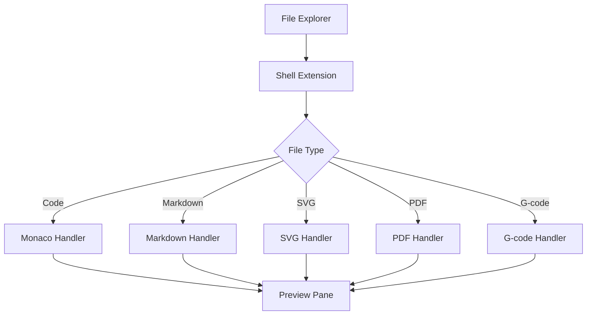

## Overview

File Explorer Add-ons extend Windows File Explorer with preview and thumbnail support for file types not natively supported by Windows. View file contents directly in the preview pane without opening external applications.

<Tip>
File Explorer Add-ons work with Windows File Explorer's built-in preview pane (Alt+P to toggle).
</Tip>

## Activation

<Steps>
  <Step title="Enable File Explorer Add-ons">
    Open PowerToys Settings and navigate to **File Explorer** section
  </Step>
  
  <Step title="Enable Individual Handlers">
    Toggle on the preview handlers you want to use
  </Step>
  
  <Step title="Show Preview Pane">
    In File Explorer, press `Alt+P` or click View → Preview pane
  </Step>
  
  <Step title="Select File">
    Click on a supported file to see preview
  </Step>
</Steps>

## Key Features

### Supported File Types

<CardGroup cols={2}>
  <Card title="Code Files" icon="code">
    **Monaco Preview Handler**
    
    Syntax-highlighted code preview
    
    .cs, .cpp, .py, .js, .ts, .json, .xml, .html, .css, .md, .sql
  </Card>
  
  <Card title="Markdown" icon="markdown">
    **Markdown Preview Handler**
    
    Rendered Markdown documents
    
    .md, .markdown
  </Card>
  
  <Card title="SVG Images" icon="image">
    **SVG Preview & Thumbnail**
    
    Vector graphics preview
    
    .svg files
  </Card>
  
  <Card title="PDF Documents" icon="file-pdf">
    **PDF Preview & Thumbnail**
    
    PDF document preview
    
    .pdf files
  </Card>
  
  <Card title="G-code" icon="cube">
    **G-code Preview & Thumbnail**
    
    3D printing code preview
    
    .gcode, .bgcode files
  </Card>
  
  <Card title="STL Models" icon="cube">
    **STL Thumbnail**
    
    3D model thumbnails
    
    .stl files
  </Card>
  
  <Card title="QOI Images" icon="image">
    **QOI Preview & Thumbnail**
    
    "Quite OK Image" format
    
    .qoi files
  </Card>
</CardGroup>

### Preview Handlers

Preview handlers display file contents in the preview pane:

<Tabs>
  <Tab title="Monaco Code Preview">
    **Features:**
    - Syntax highlighting
    - Line numbers
    - Multiple language support
    - Read-only view
    
    **Supported languages:**
    - C/C++/C#
    - Python
    - JavaScript/TypeScript
    - JSON/XML
    - HTML/CSS
    - Markdown
    - SQL
    - And 50+ more
    
    **Implementation:** Uses Monaco Editor (VS Code's editor)
  </Tab>
  
  <Tab title="Markdown Preview">
    **Features:**
    - Rendered HTML output
    - Supports GFM (GitHub Flavored Markdown)
    - Code blocks with syntax highlighting
    - Tables, lists, images
    - Links (clickable in preview)
    
    **Supported elements:**
    - Headers, paragraphs, lists
    - Code blocks with syntax highlighting
    - Tables and blockquotes
    - Images and links
  </Tab>
  
  <Tab title="PDF Preview">
    **Features:**
    - Page rendering
    - Zoom support
    - Multi-page documents
    - Text selection
    
    **Note:** Basic preview functionality. For advanced features, open in full PDF reader.
  </Tab>
  
  <Tab title="SVG Preview">
    **Features:**
    - Vector rendering
    - Scalable display
    - Preserves quality
    - Supports animations
    
    **File types:**
    - .svg (Scalable Vector Graphics)
    - Embedded in HTML
  </Tab>
  
  <Tab title="G-code Preview">
    **Features:**
    - 3D toolpath visualization
    - Layer view
    - Code syntax highlighting
    - Print time/filament estimates
    
    **Formats:**
    - .gcode (standard G-code)
    - .bgcode (binary G-code)
  </Tab>
</Tabs>

### Thumbnail Providers

Generate thumbnails for File Explorer icon view:

```cpp
// Thumbnail provider interface implementation
class ThumbnailProvider : public IThumbnailProvider
{
public:
    // Generate thumbnail from file
    HRESULT GetThumbnail(
        UINT cx,              // Requested width
        HBITMAP *phbmp,       // Output bitmap
        WTS_ALPHATYPE *pdwAlpha  // Alpha channel type
    );
};
```

**Supported:**
- **SVG Thumbnail**: Rasterized vector graphics
- **PDF Thumbnail**: First page preview
- **STL Thumbnail**: 3D model render
- **G-code Thumbnail**: Embedded preview image or toolpath
- **QOI Thumbnail**: Decoded QOI image

## Configuration

### Enable/Disable Handlers

Individually control each preview handler:

<ParamField path="monaco_preview" type="boolean" default="false">
  Enable Monaco code preview handler
  
  **Performance note:** May be slower for very large files
</ParamField>

<ParamField path="markdown_preview" type="boolean" default="false">
  Enable Markdown preview handler
</ParamField>

<ParamField path="svg_preview" type="boolean" default="false">
  Enable SVG preview handler
</ParamField>

<ParamField path="svg_thumbnail" type="boolean" default="false">
  Enable SVG thumbnail provider
</ParamField>

<ParamField path="pdf_preview" type="boolean" default="false">
  Enable PDF preview handler
</ParamField>

<ParamField path="pdf_thumbnail" type="boolean" default="false">
  Enable PDF thumbnail provider
</ParamField>

<ParamField path="gcode_preview" type="boolean" default="false">
  Enable G-code preview handler
</ParamField>

<ParamField path="gcode_thumbnail" type="boolean" default="false">
  Enable G-code thumbnail provider
</ParamField>

<ParamField path="stl_thumbnail" type="boolean" default="false">
  Enable STL 3D model thumbnail provider
</ParamField>

<ParamField path="qoi_preview" type="boolean" default="false">
  Enable QOI image preview handler
</ParamField>

<ParamField path="qoi_thumbnail" type="boolean" default="false">
  Enable QOI image thumbnail provider
</ParamField>

### File Association

Preview handlers register for specific file extensions in Windows registry:

```
HKEY_CLASSES_ROOT\.md
  └─ shellex
      └─ {8895b1c6-b41f-4c1c-a562-0d564250836f}
          = "{CLSID of MarkdownPreviewHandler}"
```

**Automatic registration:** PowerToys installer handles registration

## Use Cases

### Software Development

<AccordionGroup>
  <Accordion title="Code Review">
    Quick preview of source code files:
    
    1. Enable Monaco preview handler
    2. Navigate to project directory
    3. Click files to preview without opening IDE
    4. Review code changes quickly
    
    **Benefits:**
    - Syntax highlighting
    - No need to open full editor
    - Fast file browsing
  </Accordion>
  
  <Accordion title="Documentation">
    Preview README and documentation:
    
    - Enable Markdown preview
    - Click README.md to see rendered output
    - Review docs before editing
    - Verify formatting
  </Accordion>
  
  <Accordion title="Configuration Files">
    Preview JSON, XML, YAML configs:
    
    ```plaintext
    File Explorer
    ├─ config.json        ← Click to preview
    ├─ appsettings.json   ← Syntax highlighted
    └─ package.json       ← Formatted JSON
    ```
  </Accordion>
</AccordionGroup>

### Design & Graphics

<Steps>
  <Step title="SVG Management">
    Enable SVG preview and thumbnails
    
    Browse icon libraries visually
  </Step>
  
  <Step title="Quick Preview">
    Click SVG files to see vector graphics
    
    No need to open design software
  </Step>
  
  <Step title="Batch Review">
    Use thumbnail view to see all SVGs
    
    Find icons quickly
  </Step>
</Steps>

### 3D Printing

<CardGroup cols={2}>
  <Card title="G-code Inspection">
    Preview G-code files before printing
    
    - View toolpath
    - Check layer heights
    - Estimate print time
  </Card>
  
  <Card title="Model Thumbnails">
    STL thumbnail generation
    
    - Visual model previews
    - Browse models easily
    - Identify files quickly
  </Card>
</CardGroup>

### Document Management

<Tabs>
  <Tab title="PDF Preview">
    Quick document review:
    
    1. Enable PDF preview
    2. Browse document folders
    3. Click PDFs to preview
    4. No need to open full PDF reader
    
    **Use cases:**
    - Invoice review
    - Document selection
    - Quick reference
  </Tab>
  
  <Tab title="Markdown Notes">
    Personal knowledge base:
    
    - Keep notes in Markdown
    - Preview formatted output
    - Browse notes visually
    - Quick reference
  </Tab>
</Tabs>

## Technical Details

### Architecture



### Preview Handler Structure

```plaintext
src/modules/previewpane/
├─ MonacoPreviewHandler/
│   ├─ MonacoPreviewHandler.cpp     # C++ wrapper
│   └─ MonacoPreviewHandlerControl/  # .NET implementation
├─ MarkdownPreviewHandler/
│   ├─ MarkdownPreviewHandler.cpp
│   └─ MarkdownPreviewHandlerControl/
├─ SvgPreviewHandler/
├─ PdfPreviewHandler/
├─ GcodePreviewHandler/
└─ common/                      # Shared utilities
```

**Source:** `src/modules/previewpane/README.md`

### Preview Handler Process

Preview handlers run in isolated process:

```cpp
// Preview handler isolation
// Handlers run in prevhost.exe surrogate process
// Protects File Explorer from crashes
// Each handler in separate AppDomain/.NET process
```

**Benefits:**
- Crash isolation
- Memory management
- Security sandboxing

### Implementation Pattern

Typical handler implementation:

```cpp
// C++ Preview Handler Interface
class PreviewHandler : 
    public IPreviewHandler,
    public IInitializeWithStream,
    public IOleWindow
{
public:
    // Load file content
    HRESULT Initialize(IStream* pstream, DWORD grfMode);
    
    // Create preview window
    HRESULT SetWindow(HWND hwnd, const RECT* prc);
    
    // Render preview
    HRESULT DoPreview();
    
    // Cleanup
    HRESULT Unload();
};
```

## Keyboard Shortcuts

### File Explorer

| Shortcut | Action |
|----------|--------|
| `Alt+P` | Toggle preview pane |
| `Arrow Up/Down` | Navigate files (preview updates) |
| `Enter` | Open file in default application |
| `Ctrl+Scroll` | Zoom thumbnail size |

## Troubleshooting

<AccordionGroup>
  <Accordion title="Preview not showing">
    **Check:**
    - Preview pane is visible (`Alt+P`)
    - Specific handler is enabled in PowerToys Settings
    - File extension is supported
    - File is not locked/in use
    
    **Fix:**
    1. Restart File Explorer (Task Manager → Windows Explorer → Restart)
    2. Disable and re-enable handler
    3. Restart PowerToys
  </Accordion>
  
  <Accordion title="Thumbnails not generating">
    **Possible causes:**
    - Thumbnail cache corrupted
    - Handler not enabled
    - File too large
    
    **Solutions:**
    1. Enable thumbnail provider in settings
    2. Clear thumbnail cache:
       ```cmd
       del /f /s /q /a %LocalAppData%\Microsoft\Windows\Explorer\thumbcache_*.db
       ```
    3. Restart File Explorer
  </Accordion>
  
  <Accordion title="Monaco preview slow for large files">
    **Performance issue:**
    - Monaco handler loads entire file
    - Large files (>1MB) may be slow
    
    **Workaround:**
    - Disable Monaco handler for large files
    - Use external editor for large files
    - Consider file size limits in settings (if available)
  </Accordion>
  
  <Accordion title="Preview shows error or blank">
    **Debug:**
    1. Check file is not corrupted
    2. Try opening in native application
    3. Check PowerToys logs:
       ```
       %LOCALAPPDATA%\Microsoft\PowerToys\Logs
       ```
    4. Look for preview handler errors
    
    **Common issues:**
    - File encoding not supported
    - Missing dependencies
    - File format variation not supported
  </Accordion>
</AccordionGroup>

## See Also

- [File Locksmith](/utilities/file-locksmith) - Unlock files in use
- [PowerToys Run](/utilities/powertoys-run) - Quick file search
- [Image Resizer](/utilities/image-resizer) - Batch image operations
