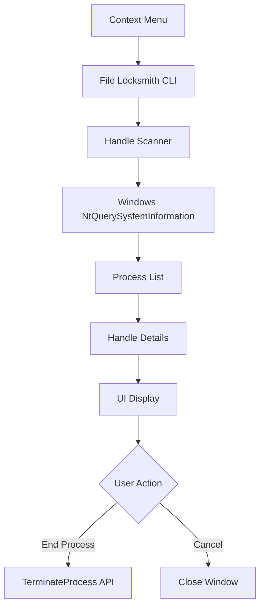

## Overview

File Locksmith helps you discover which processes are locking a file or folder, preventing deletion, moving, or modification. It integrates directly into File Explorer's context menu, allowing you to quickly identify and terminate locking processes.

<Warning>
Terminating processes may result in data loss. Always save your work before ending processes.
</Warning>

## Activation

<Steps>
  <Step title="Enable File Locksmith">
    Open PowerToys Settings and enable **File Locksmith**
  </Step>
  
  <Step title="Right-Click File/Folder">
    In File Explorer, right-click on a locked file or folder
  </Step>
  
  <Step title="Select 'What's using this file?'">
    Choose the File Locksmith option from the context menu
  </Step>
  
  <Step title="View Locking Processes">
    A window appears showing all processes using the file
  </Step>
</Steps>

## Key Features

### Process Detection

<CardGroup cols={2}>
  <Card title="File Handle Detection" icon="file">
    Identifies processes with open file handles
    
    Shows read/write access modes
  </Card>
  
  <Card title="Folder Monitoring" icon="folder">
    Detects processes accessing folders
    
    Includes files within directories
  </Card>
  
  <Card title="Multiple Files" icon="layer-group">
    Check multiple files simultaneously
    
    Select multiple files in Explorer
  </Card>
  
  <Card title="Process Details" icon="info">
    Shows process name, PID, and user
    
    Full path to executable
  </Card>
</CardGroup>

### Context Menu Integration

Seamless File Explorer integration:

```cpp
// Explorer command registration
class FileLocksmithContextMenu : public IExplorerCommand
{
public:
    // Display in context menu
    HRESULT GetTitle(IShellItemArray* items, LPWSTR* name)
    {
        *name = L"What's using this file?";
        return S_OK;
    }
    
    // Handle menu item click
    HRESULT Invoke(
        IShellItemArray* selection,
        IBindCtx* bindContext
    );
};
```

**Menu location:**
- Right-click file/folder
- "Show more options" (Windows 11)
- "What's using this file?" option

### Process Information Display

Detailed information about locking processes:

- **Process Name**: Application name
- **Process ID (PID)**: Unique process identifier
- **User**: Account running the process
- **File Path**: Full path to executable
- **Access Type**: Read, Write, or Read/Write
- **Handle Count**: Number of open handles

### Process Termination

<Tabs>
  <Tab title="End Process">
    Gracefully terminate a process:
    
    1. Select process in File Locksmith window
    2. Click "End Process" button
    3. Confirm termination
    4. Process receives termination signal
    5. File/folder is unlocked
    
    **Note:** Similar to Task Manager's "End Task"
  </Tab>
  
  <Tab title="End Process Tree">
    Terminate process and all child processes:
    
    - Useful for parent processes with children
    - Ensures complete cleanup
    - Recommended for stuck applications
    
    **Example:** Ending Visual Studio also ends MSBuild and compiler processes
  </Tab>
  
  <Tab title="Force Terminate">
    Forcefully kill unresponsive processes:
    
    - Last resort option
    - No cleanup or save opportunity
    - Use when graceful termination fails
    
    **Warning:** May cause data loss
  </Tab>
</Tabs>

## Configuration

### Settings

Minimal configuration required:

<ParamField path="enabled" type="boolean" default="false">
  Enable or disable File Locksmith
  
  Controls context menu integration
</ParamField>

<ParamField path="extended_context_menu" type="boolean" default="false">
  Show in extended context menu only
  
  Requires holding `Shift` while right-clicking
</ParamField>

### Extended Context Menu

Reduce context menu clutter:

- **Disabled**: Always visible
- **Enabled**: Only visible when holding `Shift`

**Windows 11 note:** File Locksmith appears under "Show more options" by default

## Use Cases

### File Deletion Issues

<AccordionGroup>
  <Accordion title="Cannot delete file">
    Common scenario:
    
    ```plaintext
    Error: The action can't be completed because
    the file is open in another program
    ```
    
    **Solution:**
    1. Right-click file → "What's using this file?"
    2. Identify locking process
    3. Save work in that application
    4. End process
    5. Delete file successfully
  </Accordion>
  
  <Accordion title="File in use after closing app">
    Application closed but file still locked:
    
    - Background process still running
    - Crash left handles open
    - Service holding file
    
    **Use File Locksmith to:**
    1. Find zombie process
    2. Terminate lingering handles
    3. Clean up properly
  </Accordion>
</AccordionGroup>

### Development Scenarios

<Steps>
  <Step title="DLL Rebuild Issues">
    Cannot rebuild project due to locked DLL:
    
    ```plaintext
    Error: Cannot copy 'MyLibrary.dll' because
    it is being used by another process
    ```
    
    **Identify:** Test application still running
  </Step>
  
  <Step title="Log File Access">
    Cannot delete or move log files:
    
    - Application still logging
    - Log viewer has file open
    - Background service writing logs
    
    **Find:** Which process is logging
  </Step>
  
  <Step title="Database Files">
    Database file locked:
    
    - SQLite .db file in use
    - Multiple connections open
    - Crashed application
    
    **Solution:** End all database connections
  </Step>
</Steps>

### System Maintenance

<CardGroup cols={2}>
  <Card title="Folder Deletion">
    Cannot delete folder with locked files
    
    Find all processes using folder contents
  </Card>
  
  <Card title="USB Drive Ejection">
    "Device is in use" error
    
    Identify processes accessing USB drive
  </Card>
  
  <Card title="File Moving">
    Cannot move files between folders
    
    Discover hidden locks
  </Card>
  
  <Card title="Update Installations">
    Installer cannot replace files
    
    End processes before updating
  </Card>
</CardGroup>

### Media Production

<Tabs>
  <Tab title="Video Editing">
    Video file locked by:
    - Video player in background
    - Encoder still processing
    - Preview generator
    
    **Use File Locksmith** to find and close
  </Tab>
  
  <Tab title="Audio Production">
    Audio file locked by:
    - DAW (Digital Audio Workstation)
    - Media player
    - Audio driver/service
    
    **Identify** locking application
  </Tab>
  
  <Tab title="Image Editing">
    Image file locked by:
    - Photo editor
    - Thumbnail generator
    - Image viewer
    
    **Terminate** background processes
  </Tab>
</Tabs>

### Network Shares

Files on network drives:

```plaintext
Scenario: Shared folder file locked

File: \\Server\Share\Document.docx
Issue: "File is in use by another user"

File Locksmith shows:
  - Remote user's process
  - Network session details
  - Cannot terminate remote process
  
Solution:
  - Contact user to close file
  - Administrator can force-close from server
```

## Technical Details

### Architecture



### Handle Detection

File Locksmith uses Windows APIs to enumerate handles:

```cpp
// Handle enumeration
NTSTATUS NtQuerySystemInformation(
    SYSTEM_INFORMATION_CLASS SystemInformationClass,
    PVOID SystemInformation,
    ULONG SystemInformationLength,
    PULONG ReturnLength
);

// Query handle information
NTSTATUS NtQueryObject(
    HANDLE Handle,
    OBJECT_INFORMATION_CLASS ObjectInformationClass,
    PVOID ObjectInformation,
    ULONG ObjectInformationLength,
    PULONG ReturnLength
);
```

**Process:**
1. Enumerate all system handles
2. Filter handles of type "File"
3. Query handle name/path
4. Match against target file
5. Return owning process information

### Components

| Component | Purpose | Location |
|-----------|---------|----------|
| **FileLocksmithCLI** | Command-line interface | `src/modules/FileLocksmith/FileLocksmithCLI` |
| **FileLocksmithContextMenu** | Explorer integration | `src/modules/FileLocksmith/FileLocksmithContextMenu` |
| **FileLocksmithLib** | Core handle detection | `src/modules/FileLocksmith/FileLocksmithLib` |
| **FileLocksmithUI** | User interface | `src/modules/FileLocksmith/FileLocksmithUI` |

### CLI Usage

File Locksmith can be used from command line:

```powershell
# Check what's using a file
FileLocksmith.exe "C:\Path\To\File.txt"

# Output: List of processes with PIDs
# Process: notepad.exe (PID: 1234)
# User: DOMAIN\Username
# Path: C:\Windows\System32\notepad.exe
```

**Source:** `src/modules/FileLocksmith/FileLocksmithCLI/main.cpp`

### Process Termination

Multiple termination methods:

```cpp
// Graceful termination
bool TerminateProcess(DWORD processId)
{
    HANDLE hProcess = OpenProcess(
        PROCESS_TERMINATE, 
        FALSE, 
        processId
    );
    
    if (hProcess)
    {
        // Send termination signal
        BOOL result = ::TerminateProcess(hProcess, 0);
        CloseHandle(hProcess);
        return result;
    }
    return false;
}

// Process tree termination
void TerminateProcessTree(DWORD processId)
{
    // Find child processes
    auto children = GetChildProcesses(processId);
    
    // Terminate children first
    for (auto child : children)
    {
        TerminateProcessTree(child);
    }
    
    // Terminate parent
    TerminateProcess(processId);
}
```

## Keyboard Shortcuts

### In File Locksmith Window

| Shortcut | Action |
|----------|--------|
| `Shift+Right-Click` | Show context menu (if extended menu enabled) |
| `Enter` | End selected process |
| `Delete` | End selected process |
| `Esc` | Close window |
| `F5` | Refresh process list |

## Troubleshooting

<AccordionGroup>
  <Accordion title="Context menu option not appearing">
    **Check:**
    - File Locksmith is enabled in PowerToys Settings
    - On Windows 11, check under "Show more options"
    - If extended menu enabled, hold `Shift` while right-clicking
    
    **Fix:**
    1. Restart File Explorer
    2. Disable and re-enable File Locksmith
    3. Restart PowerToys
    4. Check shell extension registration
  </Accordion>
  
  <Accordion title="No processes shown but file is locked">
    **Possible causes:**
    - System/kernel process holding file
    - File locked by Windows itself
    - Network share lock (remote process)
    - Permissions prevent detection
    
    **Solutions:**
    1. Run PowerToys as Administrator
    2. Check Windows Event Viewer for file access logs
    3. Use Process Explorer for deeper analysis
    4. Restart computer to clear all locks
  </Accordion>
  
  <Accordion title="Cannot end process">
    **Reasons:**
    - Insufficient privileges (need admin)
    - System-critical process
    - Process already terminating
    - Protected process
    
    **Try:**
    1. Run PowerToys as Administrator
    2. Use "End Process Tree" option
    3. Use Task Manager with admin rights
    4. Restart computer
    
    **Protected processes:** Cannot be terminated (e.g., csrss.exe, System)
  </Accordion>
  
  <Accordion title="File still locked after ending process">
    **Check:**
    - Process actually terminated (check Task Manager)
    - File handle cleanup may take a moment
    - Another process opened file
    - File system sync delay
    
    **Steps:**
    1. Wait a few seconds
    2. Re-run File Locksmith
    3. Check for additional locking processes
    4. Refresh File Explorer (`F5`)
  </Accordion>
</AccordionGroup>

## Limitations

<Warning>
**Cannot terminate remote processes:**

For files on network shares, File Locksmith shows which remote computer/user has the file open but cannot terminate processes on remote machines.

**Workaround:** Administrator must close file from server side or use server management tools.
</Warning>

### Kernel-Mode Locks

Some file locks are held by kernel drivers:
- Antivirus scanners
- File system filters
- Disk encryption software
- Backup agents

These may not appear in File Locksmith's process list.

### Permission Requirements

To terminate processes:
- **User processes**: No special permissions
- **Other users' processes**: Administrator rights
- **System processes**: Administrator + may be protected
- **Services**: Administrator + service control rights

## See Also

- [File Explorer Add-ons](/utilities/file-explorer-addons) - Preview file contents
- [PowerToys Run](/utilities/powertoys-run) - Quick file search
- [Process Explorer](https://learn.microsoft.com/sysinternals/downloads/process-explorer) - Advanced process analysis (Sysinternals)
