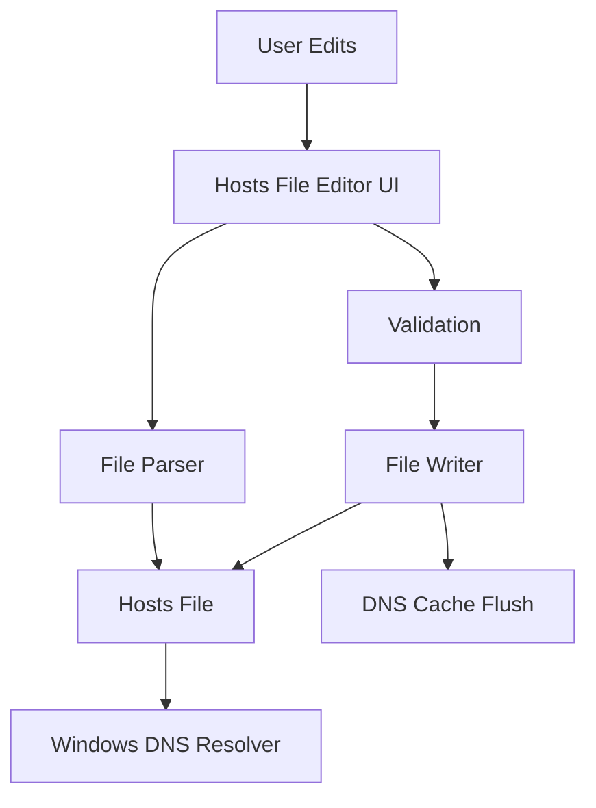

## Overview

Hosts File Editor provides a modern, user-friendly interface for managing the Windows hosts file. Instead of manually editing the text file in Notepad with administrator privileges, use this visual editor to add, edit, delete, and organize host entries with ease.

<Info>
The hosts file (`C:\Windows\System32\drivers\etc\hosts`) maps hostnames to IP addresses, overriding DNS lookups.
</Info>

## Activation

<Steps>
  <Step title="Enable Hosts File Editor">
    Open PowerToys Settings and enable **Hosts File Editor**
  </Step>
  
  <Step title="Launch Editor">
    Click "Open Hosts File Editor" in PowerToys Settings
    
    Or launch from PowerToys Run (if configured)
  </Step>
  
  <Step title="Grant Administrator Access">
    Approve UAC prompt (requires admin to modify hosts file)
  </Step>
  
  <Step title="Edit Entries">
    Add, modify, or delete host entries in the visual interface
  </Step>
</Steps>

## Key Features

### Visual Host Management

<CardGroup cols={2}>
  <Card title="Add Entries" icon="plus">
    Create new host mappings visually
    
    No manual file editing needed
  </Card>
  
  <Card title="Edit Entries" icon="pen">
    Modify existing entries with validation
    
    Prevents syntax errors
  </Card>
  
  <Card title="Enable/Disable" icon="toggle-on">
    Toggle entries without deleting
    
    Quick testing of configurations
  </Card>
  
  <Card title="Duplicate Detection" icon="copy">
    Warns about duplicate hostnames
    
    Prevents conflicts
  </Card>
</CardGroup>

### Entry Management

Comprehensive entry operations:

<Tabs>
  <Tab title="Add Host">
    Create new host entry:
    
    ```plaintext
    IP Address:  127.0.0.1
    Hostname:    myapp.local
    Comment:     Local development app
    Enabled:     ☑
    ```
    
    **Validation:**
    - IP address format check
    - Hostname format validation
    - Duplicate detection
    - Reserved name warning
  </Tab>
  
  <Tab title="Edit Host">
    Modify existing entries:
    
    1. Select entry in list
    2. Click "Edit" or double-click
    3. Modify fields
    4. Save changes
    
    **Changes apply immediately** to hosts file
  </Tab>
  
  <Tab title="Delete Host">
    Remove entries:
    
    - Select entry
    - Click "Delete" button
    - Confirm deletion
    - Entry removed from hosts file
    
    **Note:** Deletion is permanent
  </Tab>
  
  <Tab title="Toggle State">
    Enable/disable without deleting:
    
    ```plaintext
    Enabled:  127.0.0.1  myapp.local
    Disabled: # 127.0.0.1  myapp.local
    ```
    
    Disabled entries are commented out in hosts file
  </Tab>
</Tabs>

### Filtering and Search

Quickly find entries:

- **Search by hostname**: Filter entries by name
- **Search by IP**: Find all hostnames for IP
- **Filter by status**: Show only enabled or disabled
- **Quick jump**: Type to jump to entry

### Validation

Built-in validation prevents errors:

```csharp
// IP Address validation
public bool IsValidIPAddress(string ip)
{
    return IPAddress.TryParse(ip, out _);
}

// Hostname validation
public bool IsValidHostname(string hostname)
{
    // RFC 1123 hostname rules
    var regex = new Regex(@"^([a-zA-Z0-9-]+\.)*[a-zA-Z0-9-]+$");
    return regex.IsMatch(hostname) && 
           hostname.Length <= 253 &&
           !hostname.StartsWith("-") &&
           !hostname.EndsWith("-");
}

// Duplicate check
public bool IsDuplicate(string hostname)
{
    return ExistingHosts.Any(h => 
        h.Hostname.Equals(hostname, 
        StringComparison.OrdinalIgnoreCase));
}
```

### Backup and Restore

Protect against mistakes:

- **Automatic Backup**: Create backup before changes
- **Manual Backup**: Save current hosts file copy
- **Restore**: Revert to previous backup
- **Backup Location**: `%LOCALAPPDATA%\Microsoft\PowerToys\Hosts\Backups`

## Configuration

### Hosts File Location

Standard Windows hosts file:
```
C:\Windows\System32\drivers\etc\hosts
```

**Requires Administrator** privileges to modify.

### Editor Settings

<ParamField path="auto_backup" type="boolean" default="true">
  Automatically create backup before changes
  
  Recommended: Keep enabled
</ParamField>

<ParamField path="warn_duplicates" type="boolean" default="true">
  Show warning when adding duplicate hostname
</ParamField>

<ParamField path="show_comments" type="boolean" default="true">
  Display comment field for entries
</ParamField>

<ParamField path="apply_immediately" type="boolean" default="true">
  Save changes to hosts file immediately
  
  If disabled, must click "Apply" to save
</ParamField>

### DNS Cache

After modifying hosts file, flush DNS cache:

```powershell
# Flush DNS cache to apply changes immediately
ipconfig /flushdns
```

**Note:** Hosts File Editor can automatically flush DNS cache after changes.

## Use Cases

### Local Development

<AccordionGroup>
  <Accordion title="Development Domains">
    Map development domains to localhost:
    
    ```plaintext
    127.0.0.1    myapp.local
    127.0.0.1    api.myapp.local
    127.0.0.1    admin.myapp.local
    ```
    
    **Benefits:**
    - Use friendly domain names
    - Test subdomain routing
    - Match production domain structure
    - SSL certificate testing
  </Accordion>
  
  <Accordion title="Multi-Project Setup">
    Manage multiple project domains:
    
    ```plaintext
    # Project A
    127.0.0.1    projecta.local
    127.0.0.1    api.projecta.local
    
    # Project B  
    127.0.0.1    projectb.local
    127.0.0.1    api.projectb.local
    ```
    
    **Toggle projects:** Enable/disable groups as needed
  </Accordion>
  
  <Accordion title="Microservices">
    Local microservices development:
    
    ```plaintext
    127.0.0.1    frontend.local
    127.0.0.1    auth-service.local
    127.0.0.1    api-gateway.local
    192.168.1.100    database.local
    ```
  </Accordion>
</AccordionGroup>

### Testing and QA

<Steps>
  <Step title="Staging Environment">
    Point production domains to staging servers:
    
    ```plaintext
    # Temporarily redirect to staging
    10.0.0.50    www.production-site.com
    10.0.0.50    api.production-site.com
    ```
  </Step>
  
  <Step title="Test Environment">
    Access test servers with production domains:
    
    ```plaintext
    192.168.1.50    app.company.com
    ```
    
    **Use case:** Test with real domain names
  </Step>
  
  <Step title="A/B Testing">
    Switch between different backend servers:
    
    ```plaintext
    # Version A
    10.0.1.10    api.service.com
    
    # Version B (enable to test)
    # 10.0.1.20    api.service.com
    ```
  </Step>
</Steps>

### Network Troubleshooting

<CardGroup cols={2}>
  <Card title="DNS Override">
    Bypass DNS for specific domains
    
    Useful when DNS is down or incorrect
  </Card>
  
  <Card title="Internal Services">
    Access internal services by hostname
    
    Map internal IPs to friendly names
  </Card>
  
  <Card title="Block Domains">
    Redirect unwanted domains to 0.0.0.0
    
    Ad blocking, malware prevention
  </Card>
  
  <Card title="Network Testing">
    Test application behavior with different IPs
    
    Simulate different network conditions
  </Card>
</CardGroup>

### Content Filtering

<Tabs>
  <Tab title="Ad Blocking">
    Block advertisement domains:
    
    ```plaintext
    0.0.0.0    ads.example.com
    0.0.0.0    tracking.example.com
    0.0.0.0    analytics.example.com
    ```
    
    **Note:** Browser-based ad blockers more effective
  </Tab>
  
  <Tab title="Malware Protection">
    Block known malicious domains:
    
    ```plaintext
    0.0.0.0    malware-site.com
    0.0.0.0    phishing-site.com
    ```
    
    **Security note:** Use proper antivirus/firewall
  </Tab>
  
  <Tab title="Parental Controls">
    Block inappropriate content:
    
    ```plaintext
    0.0.0.0    restricted-site.com
    ```
    
    **Limitation:** Easy to bypass, use proper parental control software
  </Tab>
</Tabs>

### Enterprise Scenarios

<AccordionGroup>
  <Accordion title="Internal Applications">
    Map internal app hostnames:
    
    ```plaintext
    10.20.30.40    hr-portal.internal
    10.20.30.41    crm.internal
    10.20.30.42    wiki.internal
    ```
    
    **Better alternative:** Use internal DNS server
  </Accordion>
  
  <Accordion title="Load Balancer Testing">
    Test individual backend servers:
    
    ```plaintext
    # Bypass load balancer to test specific server
    192.168.1.101    api.company.com
    ```
  </Accordion>
</AccordionGroup>

## Technical Details

### Architecture



### Hosts File Format

Standard hosts file syntax:

```plaintext
# Comments start with hash
# Format: IP_address  hostname  [aliases...]  # optional comment

127.0.0.1       localhost
::1             localhost

# Custom entries
192.168.1.100   server.local  server  # Development server
0.0.0.0         ads.example.com  # Block ads
```

### File Parsing

```csharp
// Host entry model
public class HostEntry
{
    public string IpAddress { get; set; }
    public string Hostname { get; set; }
    public List<string> Aliases { get; set; }
    public string Comment { get; set; }
    public bool IsEnabled { get; set; }
    public int LineNumber { get; set; }
}

// Parse hosts file
public List<HostEntry> ParseHostsFile(string path)
{
    var entries = new List<HostEntry>();
    var lines = File.ReadAllLines(path);
    
    foreach (var line in lines)
    {
        var entry = ParseLine(line);
        if (entry != null)
        {
            entries.Add(entry);
        }
    }
    
    return entries;
}
```

**Source:** `src/modules/Hosts/Hosts/Helpers/Host.cs`

### DNS Cache Flushing

```csharp
// Flush DNS cache after hosts file changes
public static void FlushDNSCache()
{
    var process = new Process
    {
        StartInfo = new ProcessStartInfo
        {
            FileName = "ipconfig",
            Arguments = "/flushdns",
            UseShellExecute = false,
            CreateNoWindow = true,
            RedirectStandardOutput = true
        }
    };
    
    process.Start();
    process.WaitForExit();
}
```

### Administrator Elevation

Hosts file modifications require admin rights:

```csharp
// Check if running as administrator
public static bool IsAdministrator()
{
    var identity = WindowsIdentity.GetCurrent();
    var principal = new WindowsPrincipal(identity);
    return principal.IsInRole(WindowsBuiltInRole.Administrator);
}

// Request elevation
if (!IsAdministrator())
{
    // Restart with admin rights
    var startInfo = new ProcessStartInfo
    {
        FileName = Application.ExecutablePath,
        Verb = "runas"  // Request elevation
    };
    Process.Start(startInfo);
}
```

## Troubleshooting

<AccordionGroup>
  <Accordion title="Changes not taking effect">
    **Flush DNS cache:**
    
    ```powershell
    ipconfig /flushdns
    ```
    
    **Also try:**
    1. Close and reopen browser
    2. Clear browser cache
    3. Restart application
    4. Check hosts file saved correctly
  </Accordion>
  
  <Accordion title="Cannot save changes">
    **Permission denied:**
    
    1. Ensure Hosts File Editor running as Administrator
    2. Check hosts file not locked by another program
    3. Verify antivirus not blocking changes
    4. Check file permissions
    
    **File location:** `C:\Windows\System32\drivers\etc\hosts`
  </Accordion>
  
  <Accordion title="Hostname not resolving">
    **Verify entry:**
    
    ```powershell
    # Check if hostname in hosts file
    Get-Content C:\Windows\System32\drivers\etc\hosts | Select-String "myhost"
    
    # Test resolution
    ping myhost.local
    nslookup myhost.local
    ```
    
    **Common issues:**
    - Entry is disabled (commented out)
    - Typo in hostname
    - Wrong IP address
    - DNS cache not flushed
  </Accordion>
  
  <Accordion title="Duplicate entries warning">
    **Multiple entries for same hostname:**
    
    ```plaintext
    127.0.0.1    myapp.local
    192.168.1.100    myapp.local  # Duplicate!
    ```
    
    **Windows uses first matching entry**
    
    **Solution:**
    1. Remove or disable duplicate
    2. Choose correct IP address
    3. Use aliases if needed
  </Accordion>
</AccordionGroup>

## Best Practices

<Warning>
**Security Considerations:**

1. **Backup before changes**: Always keep backup
2. **Validate entries**: Ensure IP addresses are correct
3. **Document changes**: Use comments liberally
4. **Review regularly**: Remove unused entries
5. **Be cautious with 0.0.0.0**: Blocking domains can break functionality
</Warning>

### Organization Tips

```plaintext
# Group entries logically with comments

# =========================
# Local Development
# =========================
127.0.0.1    myapp.local
127.0.0.1    api.myapp.local

# =========================
# Staging Environment
# =========================
10.0.0.50    staging.myapp.com

# =========================
# Ad Blocking
# =========================
0.0.0.0    ads.example.com
0.0.0.0    tracking.example.com
```

## See Also

- [PowerToys Run](/utilities/powertoys-run) - Quick launch Hosts Editor
- [Environment Variables](/utilities/environment-variables) - Related system configuration
- [Command Not Found](/utilities/command-not-found) - Network tool installation
