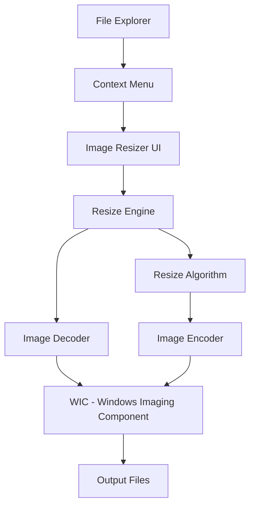

## Overview

Image Resizer is a Windows Shell Extension that enables quick batch resizing of images directly from File Explorer. Right-click on one or multiple images to resize them using predefined or custom dimensions without opening any image editing software.

<Tip>
Image Resizer preserves EXIF metadata by default and can handle multiple image formats simultaneously.
</Tip>

## Activation

<Steps>
  <Step title="Enable Image Resizer">
    Open PowerToys Settings and enable **Image Resizer**
  </Step>
  
  <Step title="Select Images">
    In File Explorer, select one or more image files
  </Step>
  
  <Step title="Open Context Menu">
    Right-click on the selected images
  </Step>
  
  <Step title="Choose Resize Images">
    Click "Resize pictures" or "Resize images" option
  </Step>
  
  <Step title="Configure and Resize">
    Choose size preset or custom dimensions, then click Resize
  </Step>
</Steps>

## Key Features

### Batch Processing

<CardGroup cols={2}>
  <Card title="Multiple Files" icon="images">
    Resize hundreds of images at once
    
    Select all, right-click, resize
  </Card>
  
  <Card title="Mixed Formats" icon="file-image">
    Process different image formats together
    
    JPG, PNG, BMP, TIFF, GIF, TGA
  </Card>
  
  <Card title="Preserve Originals" icon="copy">
    Keep original files intact
    
    Creates new resized copies
  </Card>
  
  <Card title="Custom Output" icon="folder">
    Choose output location and naming
    
    Flexible file organization
  </Card>
</CardGroup>

### Size Presets

Built-in common image sizes:

<Tabs>
  <Tab title="Small">
    **Default: 854 × 480 pixels**
    
    - Social media thumbnails
    - Email attachments
    - Quick previews
    
    Customizable in settings
  </Tab>
  
  <Tab title="Medium">
    **Default: 1366 × 768 pixels**
    
    - Web images
    - Blog photos
    - Standard displays
    
    Good balance of quality and size
  </Tab>
  
  <Tab title="Large">
    **Default: 1920 × 1080 pixels**
    
    - HD displays
    - Presentations
    - Large web images
    
    Full HD resolution
  </Tab>
  
  <Tab title="Phone">
    **Default: 320 × 568 pixels**
    
    - Mobile wallpapers
    - App mockups
    - Phone-optimized images
    
    Portrait orientation
  </Tab>
  
  <Tab title="Custom">
    **User-defined dimensions**
    
    - Exact pixel dimensions
    - Percentage of original
    - Width or height only (maintain aspect)
    
    Maximum flexibility
  </Tab>
</Tabs>

### Resize Options

Multiple resizing modes:

```csharp
// Resize modes available
public enum ResizeMode
{
    Fit,              // Fit within dimensions (default)
    Fill,             // Fill dimensions (may crop)
    Stretch,          // Stretch to exact dimensions
    ShrinkOnly,       // Only shrink, never enlarge
    Percentage        // Scale by percentage
}
```

<Tabs>
  <Tab title="Fit (Default)">
    Resize to fit within dimensions while maintaining aspect ratio:
    
    ```plaintext
    Target: 1000×1000
    
    Input: 2000×1000   →  Output: 1000×500
    Input: 1000×2000   →  Output: 500×1000
    ```
    
    **Best for:** Preserving image proportions
  </Tab>
  
  <Tab title="Fill">
    Fill target dimensions, cropping if necessary:
    
    ```plaintext
    Target: 1000×1000
    
    Input: 2000×1000   →  Output: 1000×1000 (cropped)
    Input: 1000×2000   →  Output: 1000×1000 (cropped)
    ```
    
    **Best for:** Fixed-size thumbnails
  </Tab>
  
  <Tab title="Stretch">
    Force exact dimensions:
    
    ```plaintext
    Target: 1000×1000
    
    All inputs  →  Output: 1000×1000 (may distort)
    ```
    
    **Best for:** When exact size is required
    
    **Warning:** May distort images
  </Tab>
  
  <Tab title="Percentage">
    Scale by percentage:
    
    ```plaintext
    Scale: 50%
    
    Input: 2000×1000   →  Output: 1000×500
    Input: 800×600     →  Output: 400×300
    ```
    
    **Best for:** Uniform scaling
  </Tab>
</Tabs>

### File Naming

Customizable output file names:

<ParamField path="naming_pattern" type="string" default="%1 (%2)">
  Output filename pattern
  
  **Tokens:**
  - `%1` - Original filename
  - `%2` - Size name (e.g., "Small", "Medium")
  - `%3` - Selected width
  - `%4` - Selected height
  - `%5` - Actual width
  - `%6` - Actual height
</ParamField>

**Examples:**
```plaintext
Pattern: "%1 (%2)"
Input:   photo.jpg
Output:  photo (Medium).jpg

Pattern: "%1_%3x%4"
Input:   photo.jpg
Output:  photo_1920x1080.jpg

Pattern: "%1_resized"
Input:   photo.jpg  
Output:  photo_resized.jpg
```

### Format and Quality

<ParamField path="output_format" type="enum" default="Original">
  Output image format
  
  Options:
  - Original (maintain input format)
  - PNG
  - JPEG
  - BMP
  - TIFF
  - GIF
</ParamField>

<ParamField path="jpeg_quality" type="number" default="90">
  JPEG compression quality (1-100)
  
  Higher = better quality, larger file size
</ParamField>

<ParamField path="png_interlacing" type="boolean" default="false">
  Enable PNG interlacing for progressive loading
</ParamField>

<ParamField path="tiff_compression" type="enum" default="None">
  TIFF compression method
  
  Options: None, LZW, ZIP, CCITT
</ParamField>

### EXIF Data Preservation

```csharp
// EXIF metadata handling
public class ImageResizerOptions
{
    public bool KeepExifData { get; set; } = true;
    
    // Preserved metadata:
    // - Camera make/model
    // - Date taken
    // - GPS coordinates
    // - Copyright information
    // - Image orientation
    // - Camera settings (ISO, aperture, etc.)
}
```

**Toggle in settings:** Option to remove EXIF data for privacy.

## Configuration

### Size Presets

Customize the built-in presets:

1. Open PowerToys Settings
2. Navigate to Image Resizer
3. Click "Edit" on any size preset
4. Modify dimensions and name
5. Add new custom sizes with "+"

**Example custom sizes:**
```plaintext
Instagram Square:  1080 × 1080
Facebook Cover:    820 × 312
Twitter Header:    1500 × 500
YouTube Thumbnail: 1280 × 720
4K:                3840 × 2160
```

### Advanced Settings

<ParamField path="shrink_only" type="boolean" default="false">
  Only shrink images, never enlarge
  
  Prevents quality loss from upscaling
</ParamField>

<ParamField path="replace_original" type="boolean" default="false">
  Replace original files with resized versions
  
  **Warning:** Cannot be undone
</ParamField>

<ParamField path="ignore_orientation" type="boolean" default="false">
  Ignore EXIF orientation flag
  
  Use if images appear rotated
</ParamField>

<ParamField path="output_directory" type="string" default="Same as input">
  Where to save resized images
  
  Options:
  - Same folder as originals
  - Custom directory
  - Ask each time
</ParamField>

<ParamField path="encoder_parameters" type="advanced">
  Format-specific encoding options
  
  - JPEG: Quality, progressive
  - PNG: Compression level, interlacing
  - TIFF: Compression type
</ParamField>

## Use Cases

### Web Development

<AccordionGroup>
  <Accordion title="Optimize Website Images">
    Reduce image file sizes for faster loading:
    
    ```plaintext
    1. Select all images for website
    2. Right-click → Resize images
    3. Choose "Medium" (1366×768)
    4. Set JPEG quality to 85%
    5. Resize → Upload optimized images
    ```
    
    **Result:** Faster page load times
  </Accordion>
  
  <Accordion title="Responsive Images">
    Create multiple sizes for responsive design:
    
    ```plaintext
    # Create small, medium, large versions
    1. Resize to 640px width   (mobile)
    2. Resize to 1024px width  (tablet)
    3. Resize to 1920px width  (desktop)
    ```
    
    Use in HTML:
    ```html
    
    ```
  </Accordion>
</AccordionGroup>

### Photography

<Steps>
  <Step title="Social Media Sharing">
    Resize photos for social platforms:
    
    **Instagram:**
    - Square: 1080×1080
    - Portrait: 1080×1350
    - Landscape: 1080×566
    
    **Facebook:**
    - Post: 1200×630
    - Cover: 820×312
  </Step>
  
  <Step title="Email Attachments">
    Reduce file size for email:
    
    1. Select photos
    2. Resize to "Small" or "Medium"
    3. JPEG quality 80-85%
    4. Attach resized versions (under 10MB total)
  </Step>
  
  <Step title="Print Preparation">
    Create print-ready sizes:
    
    - 4×6": 1800×1200 (300 DPI)
    - 5×7": 2100×1500 (300 DPI)
    - 8×10": 3000×2400 (300 DPI)
  </Step>
</Steps>

### E-commerce

<CardGroup cols={2}>
  <Card title="Product Images">
    Standardize product photo dimensions
    
    Consistent sizing across catalog
  </Card>
  
  <Card title="Thumbnails">
    Create grid thumbnails
    
    Square format for category pages
  </Card>
  
  <Card title="Zoom Images">
    Multiple resolution versions
    
    Small preview + large zoom view
  </Card>
  
  <Card title="Mobile Optimization">
    Mobile-friendly image sizes
    
    Reduce bandwidth usage
  </Card>
</CardGroup>

### Content Creation

<Tabs>
  <Tab title="Blog Images">
    Prepare blog post images:
    
    ```plaintext
    Featured image: 1200×630 (2:1 ratio)
    Inline images:  800×600 or 800×450
    Thumbnails:     400×300
    ```
  </Tab>
  
  <Tab title="Presentations">
    Resize images for PowerPoint/Keynote:
    
    ```plaintext
    Full slide:  1920×1080 (16:9)
    Half slide:  960×1080
    Quarter:     960×540
    ```
  </Tab>
  
  <Tab title="Video Thumbnails">
    YouTube/Vimeo thumbnails:
    
    ```plaintext
    YouTube:  1280×720 (16:9)
    Vimeo:    1280×720
    ```
  </Tab>
</Tabs>

## Technical Details

### Architecture



### Windows Imaging Component

Image Resizer uses Windows Imaging Component (WIC):

```cpp
// WIC-based image processing
IWICImagingFactory* factory;
IWICBitmapDecoder* decoder;
IWICBitmapFrameDecode* frame;
IWICBitmapScaler* scaler;
IWICBitmapEncoder* encoder;

// High-quality resizing
scaler->Initialize(
    frame,
    newWidth,
    newHeight,
    WICBitmapInterpolationModeFant  // High-quality Fant algorithm
);
```

**Benefits:**
- Native Windows support
- Hardware acceleration
- High-quality algorithms
- Codec extensibility

### Supported Formats

| Format | Read | Write | Notes |
|--------|------|-------|-------|
| **JPEG** | ✓ | ✓ | Adjustable quality |
| **PNG** | ✓ | ✓ | Lossless, alpha support |
| **BMP** | ✓ | ✓ | Large file sizes |
| **TIFF** | ✓ | ✓ | Multiple compression options |
| **GIF** | ✓ | ✓ | Animation preserved |
| **TGA** | ✓ | ✓ | Truevision Targa |
| **WDP** | ✓ | ✓ | Windows Media Photo |
| **HEIC** | ✓ | ✗ | Read-only (requires codec) |

### Resize Quality

Interpolation algorithms:

```cpp
enum WICBitmapInterpolationMode
{
    WICBitmapInterpolationModeNearestNeighbor,  // Fastest, lowest quality
    WICBitmapInterpolationModeLinear,           // Fast, good for thumbnails
    WICBitmapInterpolationModeCubic,            // Good quality/speed balance
    WICBitmapInterpolationModeFant              // Highest quality (default)
};
```

**Image Resizer uses Fant algorithm** for best quality.

### Project Structure

```plaintext
src/modules/imageresizer/
├─ ImageResizerCLI/           # Command-line interface
├─ ImageResizerContextMenu/  # Shell extension (C++)
├─ ImageResizerLib/          # Core resize logic
└─ ui/                       # Resize dialog UI (C#)
```

**Source:** `src/modules/imageresizer/README.md`

## Keyboard Shortcuts

### In Resize Dialog

| Shortcut | Action |
|----------|--------|
| `Enter` | Resize with current settings |
| `Esc` | Cancel and close dialog |
| `Tab` | Navigate between options |
| `Alt+S` | Toggle size dropdown |
| `Alt+R` | Resize button |

## Troubleshooting

<AccordionGroup>
  <Accordion title="Context menu option not appearing">
    **Check:**
    - Image Resizer enabled in PowerToys Settings
    - Selected files are image formats
    - On Windows 11, check "Show more options"
    
    **Fix:**
    1. Restart File Explorer
    2. Disable and re-enable Image Resizer
    3. Restart PowerToys
    4. Check shell extension registration
  </Accordion>
  
  <Accordion title="Resize fails or produces errors">
    **Possible causes:**
    - Insufficient disk space
    - Output directory not writable
    - Image file corrupted
    - Filename too long
    
    **Solutions:**
    1. Check available disk space
    2. Verify output directory permissions
    3. Try resizing one image to identify problem file
    4. Use shorter filename pattern
  </Accordion>
  
  <Accordion title="Output images poor quality">
    **Improve quality:**
    
    1. Increase JPEG quality setting (90-95)
    2. Use PNG for lossless quality
    3. Don't enlarge small images
    4. Enable "Shrink only" to prevent upscaling
    5. Use appropriate resize mode (Fit, not Stretch)
    
    **Note:** Upscaling always reduces quality
  </Accordion>
  
  <Accordion title="EXIF data lost after resize">
    **Preserve metadata:**
    
    1. Open Image Resizer settings
    2. Enable "Keep EXIF data"
    3. Resize images again
    
    **Note:** Some formats don't support EXIF (BMP, GIF)
    
    **Alternative:** Use EXIF tools to copy metadata
  </Accordion>
  
  <Accordion title="Very slow for many images">
    **Performance tips:**
    
    - Process in smaller batches (50-100 images)
    - Close other applications
    - Use SSD instead of HDD
    - Disable antivirus temporarily
    - Reduce output quality slightly
    
    **Note:** Processing hundreds of large RAW files takes time
  </Accordion>
</AccordionGroup>

## Best Practices

<Tip>
**Quality vs File Size:**

- **Web images**: JPEG 80-85 quality, 1920px max width
- **Thumbnails**: JPEG 75 quality, 400px max
- **Archival**: PNG lossless or JPEG 95 quality
- **Screenshots**: PNG lossless
- **Photos with text**: PNG or high JPEG quality
</Tip>

### Batch Processing Tips

1. **Test First**: Resize one image to verify settings
2. **Backup Originals**: Keep original files safe
3. **Consistent Naming**: Use clear filename patterns
4. **Organize Output**: Use subfolders for different sizes
5. **Document Settings**: Note what presets/settings you used

### Format Selection

```plaintext
Choose format based on content:

✓ JPEG:  Photos, complex images, gradients
✓ PNG:   Screenshots, logos, transparency, text
✗ BMP:   Avoid (large files, no benefits)
✓ TIFF:  Professional/archival (with LZW compression)
✗ GIF:   Avoid for photos (256 colors max)
```

## See Also

- [File Explorer Add-ons](/utilities/file-explorer-addons) - Preview images
- [PowerToys Run](/utilities/powertoys-run) - Quick file operations
- [Color Picker](/utilities/color-picker) - Sample image colors
