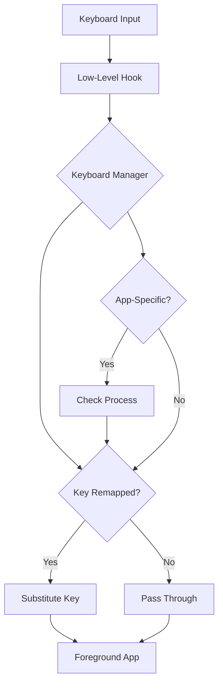

## Overview

Keyboard Manager allows you to remap keys and create custom keyboard shortcuts. Define remappings that work system-wide or configure application-specific shortcuts for ultimate keyboard customization and productivity.

<Warning>
Key remappings affect the entire system. Test carefully, especially with critical keys like Ctrl, Alt, and Win.
</Warning>

## Activation

<Steps>
  <Step title="Enable Keyboard Manager">
    Open PowerToys Settings and enable **Keyboard Manager**
  </Step>
  
  <Step title="Open Keyboard Manager">
    Click "Open Keyboard Manager" or "Remap a key" in settings
  </Step>
  
  <Step title="Choose Remapping Type">
    Select "Remap keys" or "Remap shortcuts"
  </Step>
  
  <Step title="Create Remappings">
    Define your key or shortcut remappings
  </Step>
  
  <Step title="Apply Changes">
    Click "OK" to apply remappings (takes effect immediately)
  </Step>
</Steps>

## Key Features

### Key Remapping

<CardGroup cols={2}>
  <Card title="Single Key Remap" icon="keyboard">
    Change what a key does
    
    Example: Caps Lock → Escape
  </Card>
  
  <Card title="Modifier Keys" icon="command">
    Swap or remap modifiers
    
    Example: Ctrl ↔ Alt
  </Card>
  
  <Card title="Disable Keys" icon="ban">
    Disable unwanted keys
    
    Map to "Disable" to prevent activation
  </Card>
  
  <Card title="System-Wide" icon="globe">
    Remappings work everywhere
    
    Applies to all applications
  </Card>
</CardGroup>

### Shortcut Remapping

Create custom keyboard shortcuts:

<Tabs>
  <Tab title="Global Shortcuts">
    System-wide shortcut remapping:
    
    ```plaintext
    Original:   Ctrl+B
    Remapped:   Ctrl+Shift+B
    
    Original:   Win+L
    Remapped:   Win+Shift+L
    ```
    
    **Use cases:**
    - Avoid shortcut conflicts
    - Match other OS shortcuts
    - Custom workflow shortcuts
  </Tab>
  
  <Tab title="App-Specific">
    Shortcuts that only work in specific apps:
    
    ```plaintext
    In Visual Studio Code:
      Ctrl+K → Ctrl+Shift+F  (Format document)
    
    In Chrome:
      Ctrl+T → Ctrl+Shift+T  (Reopen closed tab)
    
    In Excel:
      Ctrl+D → Ctrl+R        (Fill right instead of down)
    ```
    
    **Target by:** Application executable name
  </Tab>
  
  <Tab title="Shortcut to Key">
    Map shortcuts to single keys:
    
    ```plaintext
    Ctrl+C → F1
    Ctrl+V → F2
    ```
    
    **Useful for:**
    - Gaming (map actions to keys)
    - Macro keys
    - Accessibility
  </Tab>
  
  <Tab title="Key to Shortcut">
    Make single keys trigger shortcuts:
    
    ```plaintext
    F13 → Ctrl+Shift+T  (Reopen tab)
    F14 → Win+V         (Clipboard history)
    F15 → Win+Shift+S   (Screenshot)
    ```
    
    **Useful with:** Programmable keyboards, macros
  </Tab>
</Tabs>

### Remapping Editor

Graphical interface for configuration:

```csharp
// Remapping structure
public class KeyRemapping
{
    public uint OriginalKey { get; set; }     // Virtual key code
    public uint RemappedKey { get; set; }     // Target virtual key code
}

public class ShortcutRemapping
{
    public Shortcut Original { get; set; }
    public Shortcut Remapped { get; set; }
    public string TargetApp { get; set; }     // Optional, for app-specific
}

public class Shortcut
{
    public uint Key { get; set; }
    public bool Win { get; set; }
    public bool Ctrl { get; set; }
    public bool Alt { get; set; }
    public bool Shift { get; set; }
}
```

**Source:** `src/modules/keyboardmanager/KeyboardManagerEditorLibrary/`

### Type Key Button

Visual key selector:

1. Click "Type Key" button
2. Press the key you want to remap
3. Key name appears in field
4. Supports all keyboard keys including special keys

**Supported:**
- Letter keys (A-Z)
- Number keys (0-9)
- Function keys (F1-F24)
- Modifier keys (Ctrl, Alt, Shift, Win)
- Special keys (Home, End, PgUp, PgDn, Insert, Delete)
- Navigation keys (Arrows)
- Media keys (Play, Pause, Volume, etc.)
- Numpad keys

### Application Targeting

For app-specific remappings:

<ParamField path="target_application" type="string">
  Application executable name
  
  **Examples:**
  - `chrome.exe`
  - `Code.exe` (VS Code)
  - `EXCEL.EXE`
  - `notepad.exe`
  
  **Note:** Case-insensitive, must include .exe extension
</ParamField>

**Process name detection:**
- Keyboard Manager monitors foreground window
- Checks process executable name
- Applies remappings if match found
- Reverts to global remappings otherwise

## Configuration

### Settings Location

Remappings stored in:
```
%LOCALAPPDATA%\Microsoft\PowerToys\KeyboardManager\default.json
```

### Common Key Remappings

<AccordionGroup>
  <Accordion title="Caps Lock → Escape">
    Popular among developers:
    
    ```plaintext
    Original: Caps Lock
    Remapped: Esc
    ```
    
    **Why:** Easier to reach Escape in Vim/terminals
  </Accordion>
  
  <Accordion title="Caps Lock → Ctrl">
    Ergonomic improvement:
    
    ```plaintext
    Original: Caps Lock
    Remapped: Left Ctrl
    ```
    
    **Why:** Ctrl more accessible, less pinky strain
  </Accordion>
  
  <Accordion title="Swap Ctrl and Alt">
    For Mac users on Windows:
    
    ```plaintext
    Left Ctrl  ↔  Left Alt
    Right Ctrl ↔  Right Alt
    ```
    
    **Why:** Match macOS keyboard layout (Cmd position)
  </Accordion>
  
  <Accordion title="Disable Windows Key">
    Prevent accidental activation:
    
    ```plaintext
    Left Win  →  Disable
    Right Win →  Disable
    ```
    
    **Why:** Gaming, prevent Start menu during work
  </Accordion>
  
  <Accordion title="Right Alt → Windows">
    Easier PowerToys shortcuts:
    
    ```plaintext
    Right Alt → Left Win
    ```
    
    **Why:** Access Win shortcuts with thumb
  </Accordion>
</AccordionGroup>

### Shortcut Examples

<CodeGroup>
```plaintext Developer Shortcuts
# VS Code specific
Ctrl+K, Ctrl+D → Alt+Shift+F  (Format document)
Ctrl+` → Ctrl+J            (Toggle terminal)

# Chrome specific  
Ctrl+Shift+N → Ctrl+Shift+P  (Incognito)
```

```plaintext Productivity Shortcuts
# Global shortcuts
Win+C → Win+Shift+C         (Color Picker)
Win+R → Win+Shift+V         (Advanced Paste)

# Excel specific
Ctrl+D → Ctrl+R             (Fill right)
Ctrl+Shift+L → Ctrl+T       (Create table)
```

```plaintext Gaming Shortcuts
# Game-specific
F1 → Ctrl+Shift+1           (Quick save)
F2 → Ctrl+Shift+2           (Quick load)
F5 → Alt+Tab                (Quick switch)
```
</CodeGroup>

## Use Cases

### Ergonomic Improvements

<Steps>
  <Step title="Reduce Pinky Strain">
    Move frequently used keys closer:
    
    - Caps Lock → Backspace
    - Caps Lock → Ctrl
    - Enter → Caps Lock (if needed)
  </Step>
  
  <Step title="Thumb Optimization">
    Utilize thumb keys more:
    
    - Right Alt → Win
    - Menu Key → Ctrl
    - Space (when held) → Fn layer
  </Step>
  
  <Step title="Split Keyboard Simulation">
    Remap for comfort:
    
    - Left space for one hand
    - Right space for other
    - Reduce hand movement
  </Step>
</Steps>

### Cross-Platform Consistency

<Tabs>
  <Tab title="Mac → Windows">
    Make Windows feel like macOS:
    
    ```plaintext
    Left Alt  → Left Ctrl   (Cmd → Ctrl)
    Left Ctrl → Left Alt    (Ctrl → Option)
    
    Application-level shortcuts:
    Cmd+C (now Alt+C) → Ctrl+C
    Cmd+V (now Alt+V) → Ctrl+V
    ```
  </Tab>
  
  <Tab title="Linux → Windows">
    Match Linux keyboard behavior:
    
    ```plaintext
    # Terminal shortcuts
    Ctrl+Shift+C → Ctrl+C  (Copy in terminal)
    Ctrl+Shift+V → Ctrl+V  (Paste in terminal)
    ```
  </Tab>
</Tabs>

### Accessibility

<CardGroup cols={2}>
  <Card title="One-Handed Typing">
    Remap keys for single-hand use
    
    Mirror keyboard layout or custom layout
  </Card>
  
  <Card title="Reduced Hand Movement">
    Bring distant keys closer
    
    Minimize wrist/arm movement
  </Card>
  
  <Card title="Alternative Input">
    Map keys to easier-to-press alternatives
    
    Accommodate limited dexterity
  </Card>
  
  <Card title="Gaming Accessibility">
    Custom key layouts for gaming
    
    One-handed gaming setups
  </Card>
</CardGroup>

### Application Workflows

<AccordionGroup>
  <Accordion title="IDE Shortcuts">
    Consistent shortcuts across IDEs:
    
    ```plaintext
    In VS Code:
      Ctrl+K, Ctrl+D → Alt+Shift+F
    
    In Visual Studio:
      (Keep default Alt+Shift+F)
    
    Result: Same shortcut across both IDEs
    ```
  </Accordion>
  
  <Accordion title="Browser Extensions">
    Quick access to extension shortcuts:
    
    ```plaintext
    F1 → Alt+Shift+P  (Password manager)
    F2 → Alt+Shift+T  (Translator)
    F3 → Alt+Shift+N  (Notes)
    ```
  </Accordion>
  
  <Accordion title="Creative Software">
    Standardize shortcuts across Adobe apps:
    
    ```plaintext
    In Photoshop:
      Ctrl+Alt+I → Ctrl+Shift+I  (Match Lightroom)
    
    In Illustrator:
      Ctrl+U → Ctrl+Shift+U      (Match Photoshop)
    ```
  </Accordion>
</AccordionGroup>

## Technical Details

### Architecture



### Low-Level Keyboard Hook

Keyboard Manager uses Windows keyboard hooks:

```cpp
// Install keyboard hook
HHOOK keyboardHook = SetWindowsHookEx(
    WH_KEYBOARD_LL,           // Low-level keyboard hook
    KeyboardProc,             // Callback function
    hInstance,
    0                         // All threads
);

// Hook callback
LRESULT CALLBACK KeyboardProc(
    int nCode,
    WPARAM wParam,
    LPARAM lParam)
{
    if (nCode == HC_ACTION)
    {
        KBDLLHOOKSTRUCT* kbd = (KBDLLHOOKSTRUCT*)lParam;
        
        // Check if key should be remapped
        if (ShouldRemapKey(kbd->vkCode))
        {
            uint remappedKey = GetRemappedKey(kbd->vkCode);
            
            // Inject remapped key
            InjectKey(remappedKey, wParam);
            
            // Block original key
            return 1;
        }
    }
    
    return CallNextHookEx(keyboardHook, nCode, wParam, lParam);
}
```

**Source:** `src/modules/keyboardmanager/`

### Key Injection

Remapped keys injected via `SendInput`:

```cpp
void InjectKey(UINT vkCode, WPARAM event)
{
    INPUT input = {};
    input.type = INPUT_KEYBOARD;
    input.ki.wVk = vkCode;
    input.ki.dwFlags = (event == WM_KEYUP) ? KEYEVENTF_KEYUP : 0;
    
    SendInput(1, &input, sizeof(INPUT));
}
```

### Virtual Key Codes

Windows uses virtual key codes for keys:

```cpp
// Common virtual key codes
#define VK_BACK         0x08  // Backspace
#define VK_TAB          0x09  // Tab
#define VK_RETURN       0x0D  // Enter
#define VK_SHIFT        0x10  // Shift
#define VK_CONTROL      0x11  // Ctrl
#define VK_MENU         0x12  // Alt
#define VK_CAPITAL      0x14  // Caps Lock
#define VK_ESCAPE       0x1B  // Escape
#define VK_SPACE        0x20  // Space
// ... and many more
```

**Full list:** [MSDN Virtual-Key Codes](https://learn.microsoft.com/windows/win32/inputdev/virtual-key-codes)

## Keyboard Shortcuts

### In Keyboard Manager Editor

| Shortcut | Action |
|----------|--------|
| `Ctrl+S` | Save remappings |
| `Esc` | Cancel and close |
| `Tab` | Navigate fields |
| `Enter` | Confirm "Type Key" dialog |
| `Delete` | Remove selected remapping |

## Troubleshooting

<AccordionGroup>
  <Accordion title="Remapping not working">
    **Check:**
    - Keyboard Manager is enabled in PowerToys Settings
    - PowerToys is running
    - Remapping is defined correctly
    - No conflicting remappings
    
    **Debug:**
    1. Open Keyboard Manager editor
    2. Verify remapping exists
    3. Test with simple remap (e.g., F1 → F2)
    4. Restart PowerToys
  </Accordion>
  
  <Accordion title="Some keys not remappable">
    **Certain keys have limitations:**
    
    - **Fn key**: Usually hardware-level, cannot remap
    - **Power button**: System-level, protected
    - **Secure keys**: Ctrl+Alt+Del cannot be remapped
    
    **Elevated applications:**
    - Remappings may not work in apps running as admin
    - Run PowerToys as admin to fix
  </Accordion>
  
  <Accordion title="App-specific remapping not working">
    **Verify:**
    1. Application name matches exactly (check Task Manager)
    2. Include .exe extension
    3. Case doesn't matter, but spelling does
    4. Some UWP apps may not work (Store apps)
    
    **Example:**
    ```plaintext
    Correct:   chrome.exe
    Incorrect: Chrome
    Incorrect: chrome
    ```
  </Accordion>
  
  <Accordion title="Remapping causes typing issues">
    **Problem:** Accidentally remapped critical keys
    
    **Fix:**
    1. Open PowerToys Settings (if you can type)
    2. Disable Keyboard Manager
    3. Open Keyboard Manager editor
    4. Delete problematic remapping
    5. Re-enable Keyboard Manager
    
    **Emergency:** Use on-screen keyboard to navigate:
    - Win+Ctrl+O (open on-screen keyboard)
  </Accordion>
  
  <Accordion title="Shortcuts conflict with applications">
    **Resolution:**
    1. Use app-specific remappings instead of global
    2. Choose less common key combinations
    3. Document conflicts
    4. Consider disabling app's native shortcut
    
    **Example conflict:**
    ```plaintext
    Ctrl+Shift+E in VS Code (Explorer)
    Ctrl+Shift+E in Windows (Folder in File Explorer)
    
    Solution: Make Windows one app-specific
    ```
  </Accordion>
</AccordionGroup>

## Best Practices

<Warning>
**Safety Tips:**

1. **Test First**: Try remappings in safe environment
2. **Document Changes**: Keep list of all remappings
3. **Start Simple**: One or two remappings at a time
4. **Avoid Critical Keys**: Don't remap Ctrl, Alt without care
5. **Backup Config**: Export settings before major changes
6. **Use App-Specific**: When possible, prefer app-specific over global
</Warning>

### Recommended Remappings

```plaintext
Common productivity remappings:

✓ Caps Lock → Ctrl or Escape
  (Most users don't need Caps Lock)

✓ Right Alt → Win
  (Easier PowerToys shortcuts)

✓ Menu Key → Ctrl
  (Rarely used key becomes useful)

✗ Avoid remapping:
  - Left Ctrl (too many shortcuts depend on it)
  - Enter (critical for many operations)
  - Backspace (essential editing key)
```

## See Also

- [PowerToys Run](/utilities/powertoys-run) - Launch with custom shortcuts
- [Command Palette](/utilities/command-palette) - Keyboard-driven launcher
- [FancyZones](/utilities/fancyzones) - Window management shortcuts
