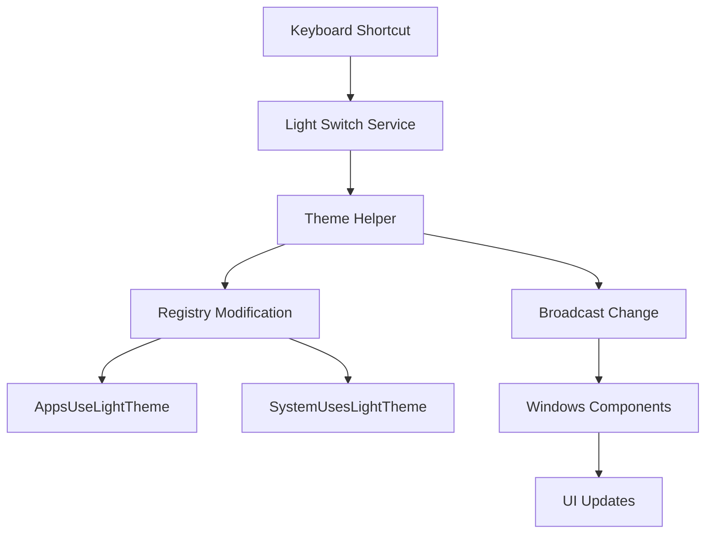

## Overview

Light Switch provides a fast way to toggle between Windows light and dark themes using a simple keyboard shortcut. Instead of navigating through Windows Settings, switch themes instantly to match your environment or preference.

<Tip>
Light Switch changes the Windows system theme, which affects most modern applications that respect system theme preferences.
</Tip>

## Activation

<Steps>
  <Step title="Enable Light Switch">
    Open PowerToys Settings and enable **Light Switch**
  </Step>
  
  <Step title="Configure Shortcut">
    Set your preferred toggle shortcut (default: `Win+Shift+T`)
  </Step>
  
  <Step title="Toggle Theme">
    Press the shortcut to switch between light and dark modes
  </Step>
</Steps>

## Key Features

### One-Key Theme Toggle

<CardGroup cols={2}>
  <Card title="Instant Switching" icon="toggle-on">
    Toggle themes with a single keyboard shortcut
    
    No menu navigation needed
  </Card>
  
  <Card title="System Theme" icon="palette">
    Changes Windows system theme setting
    
    Affects all theme-aware applications
  </Card>
  
  <Card title="App Modes" icon="desktop">
    Controls both system and app themes
    
    Comprehensive theme switching
  </Card>
  
  <Card title="Visual Feedback" icon="eye">
    Immediate visual change across Windows
    
    Taskbar, File Explorer, Settings, etc.
  </Card>
</CardGroup>

### Theme Modes

Light Switch toggles between Windows theme modes:

<Tabs>
  <Tab title="Light Mode">
    Windows light theme:
    
    ```plaintext
    System:  Light
    Apps:    Light
    
    Appearance:
    - White/light backgrounds
    - Dark text
    - Lighter taskbar
    - Bright File Explorer
    ```
    
    **Best for:** Bright environments, daytime use
  </Tab>
  
  <Tab title="Dark Mode">
    Windows dark theme:
    
    ```plaintext
    System:  Dark
    Apps:    Dark
    
    Appearance:
    - Dark backgrounds
    - Light text
    - Black taskbar
    - Dark File Explorer
    ```
    
    **Best for:** Low light, eye strain reduction, nighttime
  </Tab>
</Tabs>

### Theme Application

What Light Switch changes:

```csharp
// Theme switching implementation
public static class ThemeHelper
{
    public static void ToggleTheme()
    {
        bool isLightTheme = IsLightTheme();
        
        // Toggle to opposite theme
        SetTheme(!isLightTheme);
    }
    
    public static void SetTheme(bool lightMode)
    {
        // Change apps theme
        SetRegistryValue(
            @"HKEY_CURRENT_USER\Software\Microsoft\Windows\CurrentVersion\Themes\Personalize",
            "AppsUseLightTheme",
            lightMode ? 1 : 0
        );
        
        // Change system theme  
        SetRegistryValue(
            @"HKEY_CURRENT_USER\Software\Microsoft\Windows\CurrentVersion\Themes\Personalize",
            "SystemUsesLightTheme",
            lightMode ? 1 : 0
        );
        
        // Broadcast theme change
        BroadcastThemeChange();
    }
}
```

**Registry keys modified:**
- `AppsUseLightTheme` - Controls app theme
- `SystemUsesLightTheme` - Controls system UI theme

**Source:** `src/modules/LightSwitch/LightSwitchLib/ThemeHelper.cpp`

### Affected Components

Windows components that respond to theme change:

- **Taskbar**: Color and transparency
- **File Explorer**: Background and text colors
- **Settings App**: Full interface theming
- **Windows Terminal**: Can be configured to follow system theme
- **Modern Apps**: Microsoft Store apps that support theming
- **Browsers**: Many browsers respect system theme preference
- **Applications**: Apps that implement Windows theme support

<Info>
Legacy Win32 applications and some third-party apps may not respond to theme changes automatically.
</Info>

## Configuration

### Keyboard Shortcut

<ParamField path="toggle_shortcut" type="hotkey" default="Win+Shift+T">
  Global keyboard shortcut to toggle theme
  
  Configurable in PowerToys Settings
</ParamField>

**Customize shortcut:**
1. Open PowerToys Settings
2. Navigate to Light Switch
3. Click on shortcut field
4. Press desired key combination
5. Save changes

### Auto-Start

Light Switch automatically starts with PowerToys:
- No separate configuration needed
- Always active when PowerToys is running
- Minimal resource usage

## Use Cases

### Time-Based Switching

<AccordionGroup>
  <Accordion title="Day/Night Workflow">
    Adjust theme based on time of day:
    
    ```plaintext
    Morning:   Switch to light mode
    Evening:   Switch to dark mode
    Night:     Keep dark mode
    ```
    
    **Manual toggle:** Press shortcut when lighting changes
  </Accordion>
  
  <Accordion title="Indoor/Outdoor">
    Match theme to environment:
    
    - **Bright office**: Light mode for better visibility
    - **Dim room**: Dark mode to reduce eye strain
    - **Outside**: Light mode for screen visibility
  </Accordion>
</AccordionGroup>

### Work Scenarios

<Steps>
  <Step title="Presentation Mode">
    Switch to light mode for presentations:
    
    - Better visibility on projectors
    - Higher contrast in bright rooms
    - Professional appearance
  </Step>
  
  <Step title="Coding Sessions">
    Dark mode for extended coding:
    
    - Reduced eye strain
    - Better focus in low light
    - Popular among developers
  </Step>
  
  <Step title="Content Creation">
    Switch based on content type:
    
    - Light mode for text editing/reading
    - Dark mode for video editing
    - Dark mode for late-night work
  </Step>
</Steps>

### Accessibility

<CardGroup cols={2}>
  <Card title="Light Sensitivity">
    Quick switch to dark mode
    
    Reduces screen brightness impact
  </Card>
  
  <Card title="Visual Contrast">
    Choose preferred contrast mode
    
    Light or dark based on vision needs
  </Card>
  
  <Card title="Migraine Relief">
    Dark mode can help
    
    Reduce bright light triggers
  </Card>
  
  <Card title="Eye Strain">
    Switch to reduce fatigue
    
    Match ambient lighting
  </Card>
</CardGroup>

### Personal Preference

<Tabs>
  <Tab title="Aesthetic Choice">
    Switch based on mood or preference:
    
    - Light mode: Clean, bright, modern
    - Dark mode: Sleek, focused, professional
    
    **Instant switching** without settings navigation
  </Tab>
  
  <Tab title="Application Matching">
    Match theme to application:
    
    ```plaintext
    Using light-themed app → Light system theme
    Using dark-themed app → Dark system theme
    
    Example:
    - Word (light) → Light mode
    - VS Code (dark) → Dark mode
    ```
  </Tab>
  
  <Tab title="Testing">
    For developers/designers:
    
    - Test UI in both themes
    - Verify contrast and colors
    - Ensure theme support
    - Quick A/B comparison
  </Tab>
</Tabs>

### Integration with Other Tools

<AccordionGroup>
  <Accordion title="VS Code Theme Sync">
    Configure VS Code to follow system theme:
    
    ```json
    // settings.json
    {
      "window.autoDetectColorScheme": true,
      "workbench.preferredLightColorTheme": "Default Light+",
      "workbench.preferredDarkColorTheme": "Default Dark+"
    }
    ```
    
    Light Switch changes system theme → VS Code follows
  </Accordion>
  
  <Accordion title="Windows Terminal Theme">
    Windows Terminal can follow system theme:
    
    ```json
    // settings.json
    {
      "theme": "system"
    }
    ```
    
    Automatically switches with Light Switch
  </Accordion>
  
  <Accordion title="Browser Theme Sync">
    Modern browsers can follow system preference:
    
    **Chrome/Edge:**
    - Settings → Appearance → Theme: "System default"
    
    **Firefox:**
    - Add-ons → Themes → "Auto" theme
    
    Light Switch toggles browser appearance too
  </Accordion>
</AccordionGroup>

## Technical Details

### Architecture



### Theme Detection

Light Switch reads current theme from registry:

```cpp
// Check current theme state
bool IsLightTheme()
{
    DWORD appsTheme = 0;
    DWORD systemTheme = 0;
    DWORD dataSize = sizeof(DWORD);
    
    // Read apps theme
    RegGetValue(
        HKEY_CURRENT_USER,
        L"Software\\Microsoft\\Windows\\CurrentVersion\\Themes\\Personalize",
        L"AppsUseLightTheme",
        RRF_RT_REG_DWORD,
        nullptr,
        &appsTheme,
        &dataSize
    );
    
    // Read system theme
    RegGetValue(
        HKEY_CURRENT_USER,
        L"Software\\Microsoft\\Windows\\CurrentVersion\\Themes\\Personalize",
        L"SystemUsesLightTheme",
        RRF_RT_REG_DWORD,
        nullptr,
        &systemTheme,
        &dataSize
    );
    
    // Both should match for consistent theme
    return (appsTheme == 1 && systemTheme == 1);
}
```

### Theme Change Broadcasting

Notify Windows components of theme change:

```cpp
// Broadcast theme change to all windows
void BroadcastThemeChange()
{
    // WM_SETTINGCHANGE with "ImmersiveColorSet" parameter
    SendMessageTimeout(
        HWND_BROADCAST,
        WM_SETTINGCHANGE,
        0,
        (LPARAM)L"ImmersiveColorSet",
        SMTO_ABORTIFHUNG,
        5000,
        nullptr
    );
}
```

Applications listening for `WM_SETTINGCHANGE` with "ImmersiveColorSet" parameter will update their theme.

### Module Components

```plaintext
src/modules/LightSwitch/
├─ LightSwitchLib/
│   ├─ ThemeHelper.cpp       # Core theme switching logic
│   └─ ThemeHelper.h
└─ LightSwitchModuleInterface/
    ├─ dllmain.cpp          # Module interface
    └─ ExportedFunctions.cpp # PowerToys integration
```

**Source:** `src/modules/LightSwitch/`

### Registry Locations

Theme settings stored in Windows registry:

```plaintext
HKEY_CURRENT_USER\Software\Microsoft\Windows\CurrentVersion\Themes\Personalize

  AppsUseLightTheme:    REG_DWORD (0 = dark, 1 = light)
  SystemUsesLightTheme: REG_DWORD (0 = dark, 1 = light)
```

**Manual verification:**
```powershell
# Check current theme
Get-ItemProperty -Path "HKCU:\Software\Microsoft\Windows\CurrentVersion\Themes\Personalize" -Name "AppsUseLightTheme"
Get-ItemProperty -Path "HKCU:\Software\Microsoft\Windows\CurrentVersion\Themes\Personalize" -Name "SystemUsesLightTheme"
```

## Keyboard Shortcuts

### Default Shortcut

| Shortcut | Action |
|----------|--------|
| `Win+Shift+T` | Toggle between light and dark theme (default) |

<Note>
The shortcut is fully customizable in PowerToys Settings. Choose any available key combination.
</Note>

## Troubleshooting

<AccordionGroup>
  <Accordion title="Theme not changing">
    **Check:**
    - Light Switch is enabled in PowerToys Settings
    - PowerToys is running
    - Shortcut not conflicting with other apps
    - Windows theme settings not locked by Group Policy
    
    **Test:**
    1. Try changing theme manually in Windows Settings
    2. If manual change works, restart PowerToys
    3. Try different keyboard shortcut
  </Accordion>
  
  <Accordion title="Some apps not changing theme">
    **Not all apps support automatic theme switching:**
    
    **Will change:**
    - Windows system UI
    - File Explorer
    - Settings app
    - Microsoft Store apps that support themes
    - Modern web browsers (if configured)
    
    **May not change:**
    - Legacy Win32 applications
    - Apps with hardcoded themes
    - Some third-party software
    
    **Solution:** Manually change theme in those applications
  </Accordion>
  
  <Accordion title="Apps lag when switching theme">
    **Some applications take time to update:**
    
    - Large applications may pause briefly
    - Multiple windows may update sequentially
    - Heavy applications (IDEs, browsers with many tabs) slower
    
    **Normal behavior** - theme changes are instant but app updates vary
  </Accordion>
  
  <Accordion title="Theme reverts after switching">
    **Possible causes:**
    - Group Policy overriding theme
    - Another theme manager conflicting
    - Scheduled task changing theme
    - Third-party theme software
    
    **Check:**
    ```powershell
    # Check for Group Policy restrictions
    gpresult /r | Select-String -Pattern "Theme"
    ```
    
    **Disable other theme managers** if conflicting
  </Accordion>
  
  <Accordion title="Shortcut not working">
    **Debugging steps:**
    
    1. Verify shortcut in PowerToys Settings
    2. Check if another app uses same shortcut
    3. Try different key combination
    4. Ensure PowerToys has keyboard access
    5. Restart PowerToys
    
    **Test with simple shortcut:** `Ctrl+Alt+Shift+L`
  </Accordion>
</AccordionGroup>

## Comparison with Windows Settings

### Traditional Method (Without Light Switch)

```plaintext
Steps to change theme manually:

1. Press Win+I (open Settings)
2. Click "Personalization"
3. Click "Colors"
4. Scroll down
5. Find "Choose your mode" dropdown
6. Select "Light" or "Dark"
7. Close Settings

Total: 7 steps, ~10-15 seconds
```

### With Light Switch

```plaintext
Steps to change theme:

1. Press Win+Shift+T

Total: 1 step, instant
```

**Time saved:** 10-14 seconds per switch

**Convenience:** No context switching, no menu navigation

## Best Practices

<Tip>
**Theme Switching Tips:**

1. **Match Environment**: Switch theme based on ambient lighting
2. **Eye Health**: Use dark mode in low light to reduce strain
3. **Consistency**: Configure apps to follow system theme when possible
4. **Accessibility**: Choose theme that provides best visibility
5. **Testing**: If developing UI, test both themes regularly
</Tip>

### Application Configuration

Configure popular applications to follow system theme:

<CodeGroup>
```json VS Code
// settings.json
{
  "window.autoDetectColorScheme": true,
  "workbench.preferredLightColorTheme": "Light+ (default light)",
  "workbench.preferredDarkColorTheme": "Dark+ (default dark)"
}
```

```json Windows Terminal
// settings.json
{
  "theme": "system",
  "schemes": [
    // Your color schemes
  ]
}
```

```css Browser (Custom CSS)
/* Follow system color scheme preference */
@media (prefers-color-scheme: light) {
  body {
    background: white;
    color: black;
  }
}

@media (prefers-color-scheme: dark) {
  body {
    background: #1e1e1e;
    color: #d4d4d4;
  }
}
```
</CodeGroup>

## See Also

- [PowerToys Run](/utilities/powertoys-run) - Quick launcher (theme-aware)
- [Color Picker](/utilities/color-picker) - Pick colors in any theme
- [FancyZones](/utilities/fancyzones) - Window management (theme-aware overlays)

## Resources

- **Windows Theme Documentation**: [Microsoft Learn - Personalization](https://learn.microsoft.com/windows/apps/desktop/modernize/apply-windows-themes)
- **System Theme Detection**: [prefers-color-scheme Media Query](https://developer.mozilla.org/en-US/docs/Web/CSS/@media/prefers-color-scheme)
